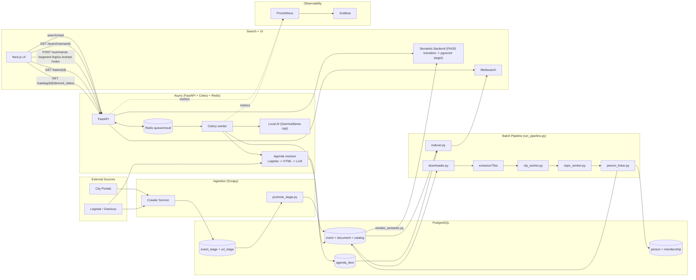

# Town Council Architecture (2026)

This document describes system structure, data flow, and reliability/security design choices.
Operational commands and troubleshooting live in [`docs/OPERATIONS.md`](docs/OPERATIONS.md).
Empirical benchmark outputs and reproduction steps live in [`docs/PERFORMANCE.md`](docs/PERFORMANCE.md).

## System Boundaries

### External inputs
- Municipal meeting portals (HTML tables/pages)
- Legistar/Granicus APIs and feeds

### Internal services
- `crawler` (Scrapy ingestion)
- `pipeline` (download, extraction, NLP, indexing)
- `api` (FastAPI)
- `worker` (Celery async tasks)
- `postgres` (system of record)
- `redis` (task queue/result backend + cache)
- `meilisearch` (search index)
- `prometheus` + `grafana` (observability)

## Architecture Diagram

## Data Flow

### 1) Ingestion and normalization
1. Crawler collects meeting metadata and document URLs into staging tables.
2. Promotion step writes canonical `event` and `document` rows.
3. Downloader stores files and links documents to `catalog` rows.

### 2) Batch enrichment
1. Text extraction writes document text to `catalog.content` and postprocesses common extraction artifacts
   (for example, spaced-letter/chunked ALLCAPS) with a deterministic repair pass, plus optional
   LLM escalation for residual improbable heading lines.
2. NLP/entity and topic workers enrich catalog records.
3. Person linker resolves official profiles and memberships.
4. Indexer publishes documents and agenda items to Meilisearch.
5. Optional vote extraction stage writes normalized outcomes/tallies to agenda-item fields.

### 3) Async user-triggered generation
1. UI calls protected API endpoints (`/summarize`, `/segment`, `/topics`, `/extract`, `/votes`).
2. API enqueues Celery tasks in Redis.
3. Worker executes task, writes DB updates, then reindexes affected catalog/entity.
4. UI polls `/tasks/{id}` for completion.

Local AI process model note:
- `LocalAI` (llama.cpp) is a singleton **per Python process**, not a cross-process singleton.
- Celery prefork/multiprocessing spawns multiple worker processes; each would load its own GGUF model copy into RAM.
- In-process backend guardrails still enforce `--pool=solo --concurrency=1`.
- D2-lite adds an HTTP inference backend (`LOCAL_AI_BACKEND=http`) so workers can run conservative parallelism (`concurrency=3`) without process-local model duplication.

## Agenda Segmentation Design

The resolver uses a maintainable source priority:
1. Legistar agenda items (when `place.legistar_client` exists)
2. Generic HTML agenda parsing
3. Local LLM fallback

Quality safeguards:
- low-quality cached items can be regenerated
- fallback parser suppresses speaker-roll/name-list pollution
- fallback parser suppresses participation template boilerplate (teleconference/COVID/ADA/how-to-join instructions)
- fallback parser rejects pleading-paper lowercase fragments using a first-alpha trap (for example `16. in the ...`)
- fallback parser carries parent-item context across page boundaries so nested sub-markers are not promoted when a list/table spans pages
- tabular-fragment suppression is weighted with alpha-density as the primary signal (whitespace artifacts are secondary)
- end-of-agenda termination requires composite legal/attestation evidence rather than `Adjournment` alone
- LLM agenda candidates pass a deterministic acceptance gate (procedural/contact rejection + substance thresholding)
- TOC/body duplicate suppression runs per document and prefers higher-page body entries over cover/TOC duplicates
- HTML cross-check parsing uses a DOM parser (not regex sanitization) before line extraction
- vote lines (`Vote:`) are mapped into agenda item `result` when available
- page context uses both `[PAGE N]` markers and inline `Page N` headers

## Vote Extraction Design (Milestone A)

Status:
- `Milestone A`: **Complete**

Vote extraction is intentionally separated from segmentation so failures in outcome parsing do not roll back agenda-item creation.

Flow:
1. Segment agenda/minutes content into `agenda_item` rows.
2. Run vote extraction over item-level context.
3. Validate model output against a strict JSON contract.
4. Persist only high-confidence, non-ambiguous outcomes.

Write hierarchy:
- `manual` and `legistar` vote sources are authoritative and are never overwritten by LLM extraction.
- LLM extraction backfills only unknown/empty results unless forced.

Persistence:
- `agenda_item.result` stores normalized outcome text (`Passed`, `Failed`, etc.).
- `agenda_item.votes` stores structured payload and extraction metadata (`source=llm_extracted`, `confidence`, tally fields).

Operational procedures and rollout controls for this stage live in [`docs/OPERATIONS.md`](docs/OPERATIONS.md).

## Derived Data Lifecycle

Derived fields are tied to extracted text by hashes:
- `catalog.content_hash`
- `catalog.summary_source_hash`
- `catalog.topics_source_hash`

States exposed to UI:
- **stale**: source hash mismatch after text changes
- **blocked**: generation rejected for low-signal input (or ungrounded summary output)
- **not generated yet**: derived field absent
- **agenda empty**: agenda segmentation ran but detected 0 substantive items (tracked on `catalog`)

Summary rendering contract:
- `catalog.summary` is stored as plain text in a sectioned decision-brief format:
  - `BLUF:`
  - `Why this matters:`
  - `Top actions:`
  - `Potential impacts:`
  - `Unknowns:`
- This avoids Markdown/HTML rendering in the UI and keeps output predictable.

Agenda summary contract:
- For `Document.category == "agenda"`, summaries are derived from segmented agenda items (Structured Agenda) to prevent drift.
- Summary generation uses a hybrid path: deterministic scaffold + constrained LLM synthesis.
- Structured payload includes title/description/classification/result/page for each retained item.
- Input assembly is hard-capped to avoid context-window overflow; partial coverage is disclosed in `Unknowns`.
- Grounding/pruning removes unsupported claim lines before persistence; weak output falls back to deterministic scaffold text.
- If an agenda has not been segmented yet, summary generation returns `not_generated_yet` and prompts segmentation first.
- If the model output is too short/noncompliant/ungrounded, the system falls back to deterministic decision-brief output.

Search index doc types:
- Meetings are indexed as `result_type="meeting"`.
- Individual `agenda_item` rows are also indexed as `result_type="agenda_item"` for drilldown searches.
- The API defaults to meeting-only search results; agenda-item hits are opt-in (`include_agenda_items=true`).

Semantic search (Milestone B):
- Status:
  - `Milestone B1 (FAISS backend)`: **Complete**
  - `Milestone B2 (pgvector backend)`: **In rollout**
- `GET /search/semantic` is additive; keyword `/search` behavior remains unchanged.
- `/search?semantic=true` enables hybrid semantic rerank on the main search endpoint.
- Retrieval uses adaptive over-fetch + in-memory filters, then de-duplicates by `catalog_id`
  before pagination so one meeting with many chunks cannot starve other results.
- FAISS artifacts remain a temporary fallback bridge during B2 hydration/validation.
- pgvector stores vectors in Postgres (`semantic_embedding`) and reranks lexical candidates.

Lineage + trends (Milestone C v1):
- `catalog.lineage_id`, `catalog.lineage_confidence`, and `catalog.lineage_updated_at` persist meeting-level lineage.
- Lineage recompute runs as a Celery task and uses a DB advisory lock to keep one authoritative writer.
- Trends endpoints are computed from Meilisearch facet distribution on `topics` (v1 avoids SQL trend-cache state).
- Search and trends route filters are built from a shared QueryBuilder contract to prevent semantic drift.
- Procedural/contact/trend-noise rules are centralized in `pipeline/lexicon.py` and imported by both pipeline and API code.

Inference provider architecture (D2-lite hardening):
- `LocalAI` is orchestration-only (prompting, grounding, fallback policy).
- Transport lives behind a provider protocol (`InferenceProvider`) with interchangeable backends:
  - `InProcessLlamaProvider`
  - `HttpInferenceProvider`
- Providers raise typed errors (`ProviderTimeoutError`, `ProviderUnavailableError`, `ProviderResponseError`)
  so orchestration can choose retry vs deterministic fallback consistently.
- Under prefork workers, provider telemetry is mirrored to Redis-backed aggregate keys so
  `tc_provider_*` series remain visible from the worker metrics endpoint.
- This telemetry path supports observability only; it does not change inference retry/timeout policy.

Re-extraction is explicit and uses existing downloaded file only (no redownload).

## Startup Purge Model (Dev)

When enabled (`STARTUP_PURGE_DERIVED=true`), startup purges derived state for deterministic local testing.

Purged:
- `agenda_item` rows
- derived `catalog` fields (`content`, summaries, topics, entities, related IDs, tables)
- content/source hash fields

Safety:
- blocked outside `APP_ENV=dev` unless explicitly overridden
- PostgreSQL advisory lock ensures one purge executor per startup wave

## Full Text Rendering Contract

- Raw extraction remains canonical in DB/API (`catalog.content`).
- Full Text readability formatting is client-side only (whitespace cleanup + `Page N` headers).
- This avoids changing data used by indexing, summarization, and segmentation.
- The UI fetches canonical Full Text from Postgres (`GET /catalog/{id}/content`), not from Meilisearch search snippets.
  This prevents “stale snippet” confusion after startup purge clears extracted text.

## Security and Reliability Model

### Security controls
- Protected write endpoints require `X-API-Key`.
- Auth failure logs include request metadata only and never include API key material.
- API key comparison uses constant-time `compare_digest` semantics.
- CORS origin allowlist is environment-controlled.
- File re-extraction path is guarded by safe-path validation.
- Frontend sends auth header only when explicitly configured.

### Reliability controls
- API and worker use async task model to keep request latency predictable.
- Task polling has explicit terminal handling for failure/error states.
- DB writes use rollback-safe transaction patterns.
- Startup health checks and fail-soft behavior keep read/search paths available when AI tasks fail.

## Observability Architecture

Prometheus scrapes:
- API metrics endpoint
- worker metrics endpoint
- PostgreSQL exporter
- Redis exporter
- cAdvisor

Provider telemetry note:
- Worker `tc_provider_*` telemetry is exported from prefork-safe aggregate data so TTFT/TPS and
  token counters are available even when requests execute in child worker processes.

Grafana dashboards are provisioned from repository files under `monitoring/grafana/`.

## Document Ownership

- Entrypoint and quickstart: [`README.md`](README.md)
- Architecture and design intent: this file (`ARCHITECTURE.md`)
- Operator runbook and commands: [`docs/OPERATIONS.md`](docs/OPERATIONS.md)
- Benchmark numbers and reproduction: [`docs/PERFORMANCE.md`](docs/PERFORMANCE.md)
- City onboarding workflow: [`docs/CONTRIBUTING_CITIES.md`](docs/CONTRIBUTING_CITIES.md)
