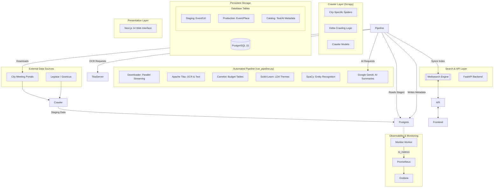

# Modernized Town Council Architecture (2026)

This document provides a visual and technical overview of the current system architecture.

## System Diagram

## Key Components

1.  **Orchestrated Pipeline:** Instead of manual steps, `run_pipeline.py` coordinates all workers, ensuring data flows logically from raw PDF to searchable index.
2.  **Container Security:** All services run as **non-root users** within minimal Docker images, utilizing multi-stage builds to reduce attack surface and image size.
3.  **AI Accuracy:** The Summarization worker uses the modern `google-genai` SDK (Gemini 2.0 Flash) with deterministic settings (temp 0.0) and grounding instructions.
4.  **Search Performance:** Meilisearch provides instant, typo-tolerant search, offloading complex text queries from the primary Postgres database.
5.  **Real-time Monitoring:** A dedicated `Monitor` worker tracks data freshness and processing counts, exporting them to **Prometheus** and **Grafana** for dashboarding and alerts.
6.  **Robust Data Flow:** The pipeline implements race-condition handling and absolute path management to ensure reliable file processing across containers.
