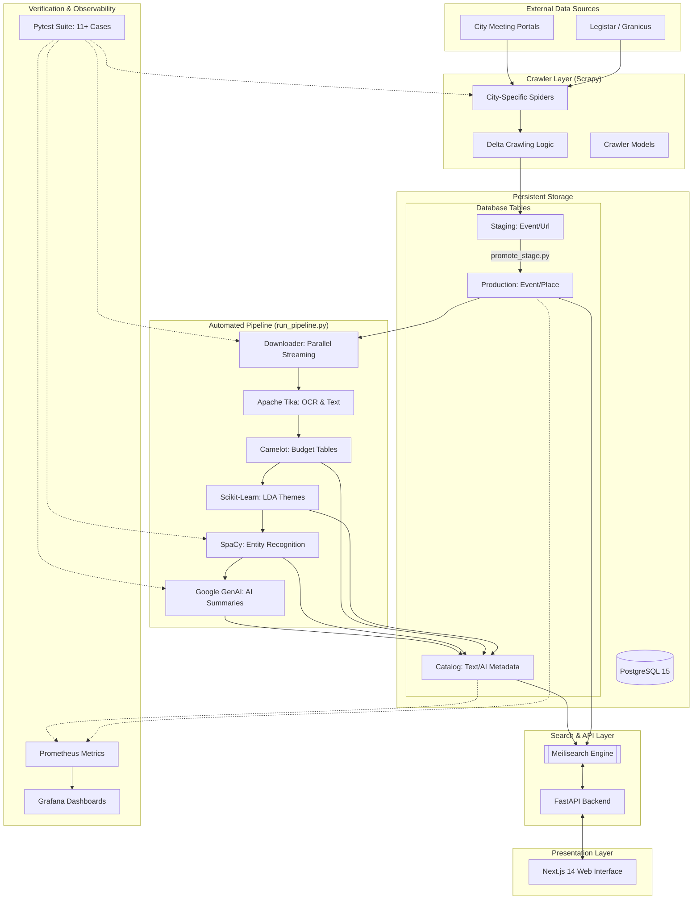

# Modernized Town Council Architecture (2026)

This document provides a visual and technical overview of the current system architecture.

## System Diagram

## Key Components

1.  **Orchestrated Pipeline:** Instead of manual steps, `run_pipeline.py` coordinates all workers, ensuring data flows logically from raw PDF to searchable index.
2.  **AI Accuracy:** The Summarization worker uses the modern `google-genai` SDK with deterministic settings (temp 0.0) and grounding instructions to prevent hallucinations.
3.  **Search Performance:** Meilisearch provides instant, typo-tolerant search, offloading complex text queries from the primary Postgres database.
4.  **Security First:** The system includes path-traversal protection, secure dependency management, and safe credential handling via environment variables.
5.  **Self-Verifying:** A `pytest` suite covers critical logic including date parsing, URL hashing, security checks, and AI mocking.
