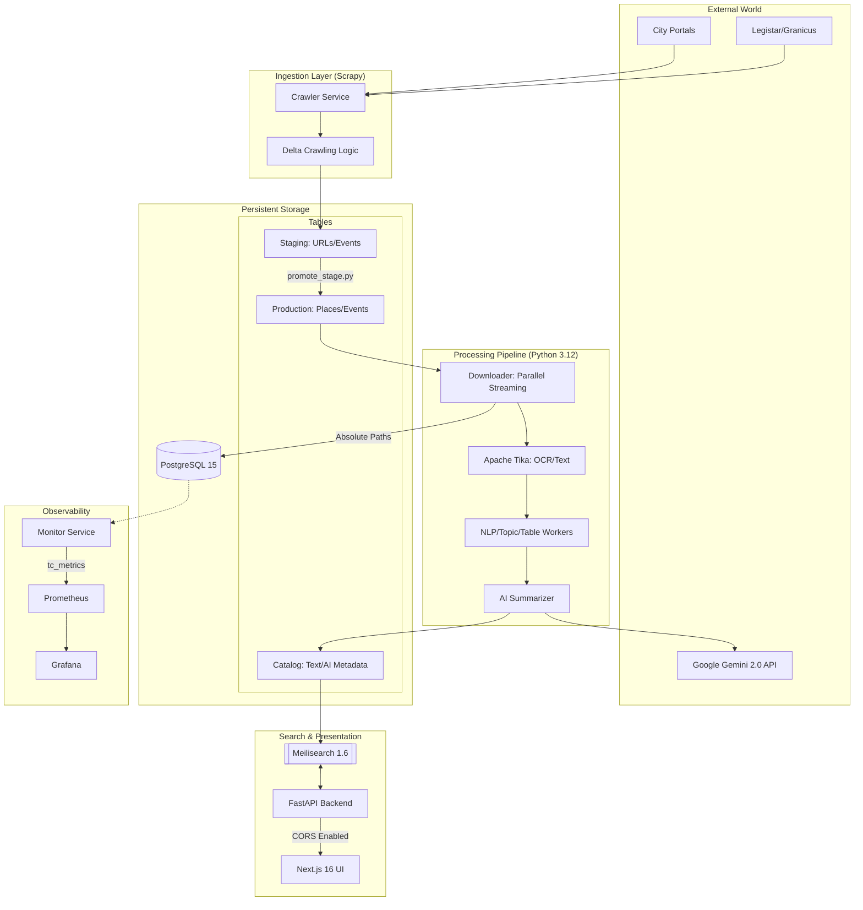

# Modernized Town Council Architecture (2026)

This document provides a technical overview of the system design, focusing on the high-performance data pipeline and security model.

## System Diagram

## Key Components & Design Principles

### 1. Ingestion Layer (Scrapy)
The system utilizes city-specific spiders to handle municipal website volatility. It supports multiple portal architectures:
*   **Table-Centric (Berkeley):** Directly parses modern city websites using high-precision XPaths.
*   **CivicPlus/Folder-Centric (Dublin):** Navigates standard government platforms that use metadata attributes (like `data-th`) for accessibility.
*   **API-Centric (Cupertino):** Communicates directly with modern platforms like **Legistar Web API**. This provides the highest reliability as it bypasses HTML complexity and bot detection.
*   **Delta Crawling:** All spiders implement a "look-back" check against the database to only fetch meetings that haven't been processed yet, saving bandwidth and compute.

### 2. Security Model
*   **Non-Root Execution:** All Docker containers run as a restricted `appuser` to minimize impact in case of a service breach.
*   **Path Traversal Protection:** The `is_safe_path` validator ensures that file processing workers only interact with authorized directories within the `DATA_DIR` scope.
*   **Credential Safety:** The system strictly uses environment variables for API keys and database credentials, with `trust_env=False` set on all network sessions to prevent accidental leakage.

### 3. High-Performance Search & UX
*   **Unified Search Hub:** The interface utilizes a segmented search bar pattern (Airbnb-style), integrating Keyword, Municipality, and Meeting Type filters into a single visual component.
*   **Dynamic Metadata Flow:** The API provides a `/metadata` endpoint that retrieves 'Facets' directly from Meilisearch. This ensures the UI dropdowns only show Cities and Bodies that actually have documents, making the system "self-healing" as new scrapers are added.
*   **Tiered Inspection:** To manage large document volumes, the UI implements a 3-tier inspection flow:
    1.  **Snippet:** Initial search match preview.
    2.  **Full Text:** On-demand expansion of complete OCR extraction.
    3.  **AI Insights:** Contextual toggle for Gemini-generated executive summaries.
*   **Decoupled Search:** Meilisearch 1.6 provides instant, typo-tolerant results, allowing the PostgreSQL database to focus on transactional consistency.

### 4. AI & NLP Strategy
*   **On-Demand Summarization:** To prevent `429 Rate Limit` errors and manage costs, the system uses a **Lazy Generation** pattern. Summaries are only generated when requested by a user in the UI via the `/summarize` API endpoint.
*   **Caching:** Once a summary is generated by **Gemini 2.0 Flash**, it is permanently saved to the `catalog` table and synced back to the Search Index. Subsequent requests for the same document are instant and cost-free.
*   **Grounding:** AI models use a deterministic temperature of 0.0 and strict instructional grounding to eliminate hallucinations.

### 5. Deployment & Build
The system uses **Multi-stage Docker builds**. Heavy build-time dependencies (compilers, headers) are discarded after the compilation phase, resulting in a lean, production-ready runtime image.