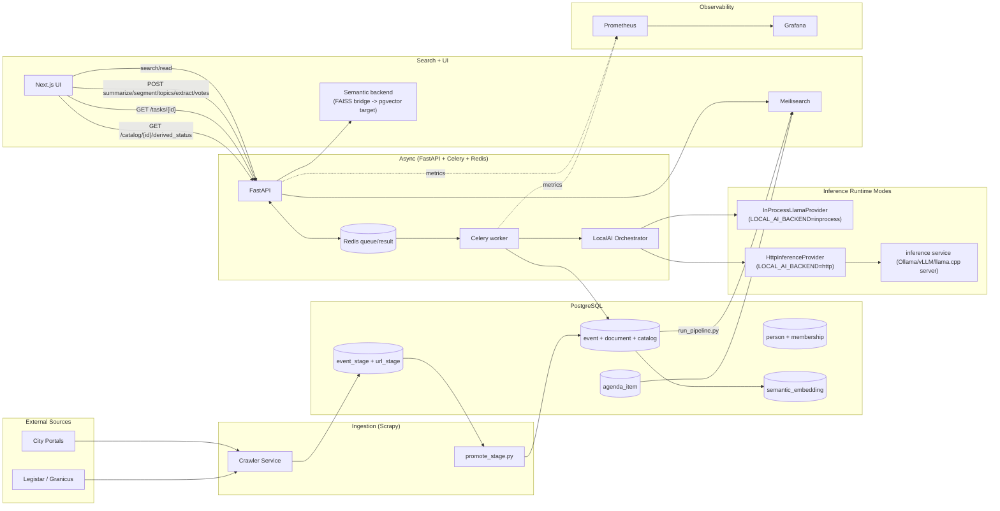

# Town Council Architecture (2026)

Last updated: 2026-02-27

This document defines stable architecture intent, data boundaries, and core contracts.
Operational tuning, rollout state, and troubleshooting are maintained in:
- [`docs/OPERATIONS.md`](docs/OPERATIONS.md)
- [`docs/PERFORMANCE.md`](docs/PERFORMANCE.md)
- [`ROADMAP.md`](ROADMAP.md) (canonical milestone status and sequencing)

## Scope Guardrails

- This file documents stable architecture behavior and interfaces.
- Runtime defaults and policy language must remain aligned with [`AGENTS.md`](AGENTS.md).
- Do not treat this file as the source of operational run commands or milestone completion status.

## System Boundaries

### External inputs
- Municipal meeting portals (HTML tables/pages)
- Legistar/Granicus APIs and feeds

### Internal services
- `crawler` (Scrapy ingestion)
- `pipeline` (batch enrichment and indexing)
- `api` (FastAPI read/write endpoints)
- `worker` (Celery async task execution)
- `inference` (HTTP LLM service when `LOCAL_AI_BACKEND=http`)
- `postgres` (system of record, including semantic and lineage data)
- `redis` (Celery queue/result backend + provider metrics aggregation)
- `meilisearch` (lexical search index)
- `prometheus` + `grafana` (observability)

## Topology Diagram

## Data Flow

### 1) Ingestion and normalization
1. Crawler writes meeting metadata and document URLs into staging tables.
2. Promotion creates canonical `event` and `document` rows.
3. Downloader stores files and links them to `catalog`.

### 2) Batch enrichment
1. Extraction writes canonical text to `catalog.content` and computes `content_hash`.
2. Topic/entity and linking stages enrich records.
3. Indexer publishes meeting and agenda-item documents to Meilisearch.
4. Semantic embedding hydration populates `semantic_embedding`.

### 3) Async user-triggered generation
1. UI calls protected write endpoints.
2. API enqueues Celery tasks in Redis.
3. Worker executes task and persists updates.
4. UI polls `/tasks/{id}` with bounded retry logic.

## Architecture Contracts

### API behavior contract

| Contract | Routes | Auth | Async | Primary owners |
|---|---|---|---|---|
| Search/read | `GET /search`, `GET /search/semantic`, `GET /catalog/{id}/lineage`, `GET /lineage/{lineage_id}` | none | no | `api/main.py`, `api/search/query_builder.py` |
| Protected generation writes | `POST /summarize/{catalog_id}`, `POST /segment/{catalog_id}`, `POST /topics/{catalog_id}`, `POST /extract/{catalog_id}`, `POST /votes/{catalog_id}` | `X-API-Key` | yes (task id returned) | `api/main.py`, `pipeline/tasks.py` |
| Task lifecycle | `GET /tasks/{task_id}` | none | n/a | `api/main.py`, Celery task backend |
| Derived status/readability | `GET /catalog/{catalog_id}/derived_status`, `GET /catalog/{catalog_id}/content` | `X-API-Key` | no | `api/main.py` |

### Data contract

| Entity/field | Contract | Primary owners |
|---|---|---|
| `catalog.content_hash` | Canonical hash for extracted text used to detect staleness | `pipeline/content_hash.py`, `pipeline/extraction_service.py`, `pipeline/tasks.py` |
| `catalog.summary_source_hash` | Hash of source text used to generate current summary | `pipeline/tasks.py`, `api/main.py` |
| `catalog.topics_source_hash` | Hash of source text used to generate current topics | `pipeline/tasks.py`, `pipeline/topic_worker.py`, `api/main.py` |
| `agenda_item.result` | Normalized outcome field for agenda/vote interpretation | `pipeline/models.py`, `pipeline/tasks.py` |
| `agenda_item.votes` | Structured vote payload with extraction metadata | `pipeline/models.py`, `pipeline/tasks.py`, `pipeline/ground_truth_sync.py` |
| `catalog.lineage_id`, `catalog.lineage_confidence`, `catalog.lineage_updated_at` | Meeting-level lineage identity and confidence | `pipeline/lineage_service.py`, `api/main.py` |
| `semantic_embedding` | pgvector-backed embedding storage for hybrid semantic retrieval | `pipeline/models.py`, `pipeline/semantic_index.py`, `pipeline/tasks.py` |

### Observability contract

| Contract | Metric/endpoint | Primary owners |
|---|---|---|
| API service metrics | `GET /metrics` on API | `api/metrics.py`, `api/main.py` |
| Worker service metrics | `GET /metrics` on worker exporter | `pipeline/metrics.py` |
| Provider transport telemetry | `tc_provider_*` (requests, duration, retries, timeouts, TTFT/TPS, token counters) | `pipeline/llm_provider.py`, `pipeline/metrics.py` |
| Prefork-safe provider visibility | Redis-backed provider metric aggregates | `pipeline/metrics.py` |

## Agenda Segmentation Design

Source priority:
1. Legistar agenda items when `place.legistar_client` exists
2. Generic HTML agenda parsing
3. Local LLM fallback with deterministic acceptance gates

Key safeguards:
- procedural/contact boilerplate suppression
- TOC/body duplicate suppression
- context-aware page boundary handling
- deterministic rejection for low-substance candidates

Primary owners:
- `pipeline/llm.py`
- `pipeline/agenda_resolver.py`

## Vote Extraction Design (Decision Integrity)

Vote extraction is intentionally separated from segmentation so outcome parsing failures do not roll back item creation.

Flow:
1. Segment agenda/minutes into `agenda_item` rows.
2. Run vote extraction over item-level context.
3. Validate output against strict JSON contract.
4. Persist high-confidence, non-ambiguous outcomes.

Write hierarchy:
- `manual` and `legistar` sources are authoritative and never overwritten by LLM extraction.
- LLM extraction backfills unknown/empty fields unless forced.

Primary owners:
- `pipeline/tasks.py`
- `pipeline/models.py`

## Semantic Search Design (Hybrid Semantic Discovery)

- `GET /search/semantic` is additive; keyword `/search` remains stable.
- `/search?semantic=true` enables hybrid semantic reranking on the main search endpoint.
- Retrieval over-fetches candidates and de-duplicates by `catalog_id` before pagination.
- FAISS is a temporary bridge path while pgvector is hydrated and validated.

Primary owners:
- `api/main.py`
- `pipeline/semantic_index.py`
- `pipeline/migrate_v8.py`

## Lineage + Trends Design (Issue Threads Foundation)

- Meeting-level lineage persists in `catalog.lineage_*`.
- Lineage recompute runs as a Celery task with advisory-lock single-writer semantics.
- Trends endpoints derive from Meilisearch facets in v1 (no SQL trend-cache layer).
- QueryBuilder contract is shared to avoid filter drift between search and trends.

Primary owners:
- `pipeline/lineage_service.py`
- `pipeline/tasks.py`
- `api/main.py`
- `api/search/query_builder.py`

## Inference Provider Architecture (Inference Decoupling & Throughput Stabilization)

- `LocalAI` handles orchestration (prompting, grounding, fallback policy).
- Transport is abstracted behind `InferenceProvider`:
  - `InProcessLlamaProvider`
  - `HttpInferenceProvider`
- Providers emit typed errors (`ProviderTimeoutError`, `ProviderUnavailableError`, `ProviderResponseError`) so orchestration can distinguish retryable paths from deterministic fallback paths.
- Under prefork workers, provider telemetry is mirrored to Redis-backed aggregates so `tc_provider_*` series remain visible.

### Hardware topology

- Default topology is local-first: worker and inference runtime are co-located on contributor machines.
- Optional personal acceleration can point `HttpInferenceProvider` at a remote HTTP endpoint (for example, within a private tailnet).
- Remote acceleration is fail-fast if unreachable; there is no silent fallback between remote and local modes.

### Future direction (non-baseline)

Compute triage/model cascading may be introduced in future roadmap phases, but it is not baseline policy today.
Current baseline defaults remain 270M-first and local-first unless roadmap/runbook policy explicitly changes.

Primary owners:
- `pipeline/llm.py`
- `pipeline/llm_provider.py`
- `pipeline/config.py`

## Frontend Architecture

- Framework: Next.js app (`frontend/app/page.js`) with client components for interactive search and result workflows.
- Shared state: centralized `SearchStateContext` (`frontend/state/search-state.js`) for query/filter/sort/search-mode coordination.
- Defensive polling: bounded task polling with increasing interval and timeout signaling (`TASK_POLL_MAX_ATTEMPTS`, interval cap, `task_poll_timeout`) in `frontend/components/ResultCard.js`.
- Security rendering contract:
  - CSP/security headers configured in `frontend/next.config.js`
  - untrusted HTML rendering paths sanitized with DOMPurify before `dangerouslySetInnerHTML` in `frontend/components/ResultCard.js`

## Security and Reliability Model

### Security controls
- Protected write endpoints require `X-API-Key`.
- API key checks use constant-time comparison (`compare_digest` semantics).
- Unauthorized access logs include request metadata only, never key material.
- CORS allowlist is environment-controlled.
- Re-extraction paths are validated before file access.

### Reliability controls
- Read/search routes are decoupled from write-heavy AI generation via async tasks.
- Task status has explicit terminal states (complete/failed/error).
- DB writes are transaction-safe.
- Startup purge and semantic startup checks are guarded for deterministic behavior.

## Document Ownership

- Entrypoint and quickstart: [`README.md`](README.md)
- Architecture and design intent: this file (`ARCHITECTURE.md`)
- Operator runbook and commands: [`docs/OPERATIONS.md`](docs/OPERATIONS.md)
- Benchmark numbers and reproducibility: [`docs/PERFORMANCE.md`](docs/PERFORMANCE.md)
- Milestone sequencing and status: [`ROADMAP.md`](ROADMAP.md)
- City onboarding workflow: [`docs/CONTRIBUTING_CITIES.md`](docs/CONTRIBUTING_CITIES.md)

## When to Update This File

Update `ARCHITECTURE.md` when any of these change:
- service boundaries or runtime topology
- durable data contracts (`catalog`/`agenda_item`/`semantic_embedding`/lineage contracts)
- trust boundaries or auth model
- observability architecture contracts (`tc_provider_*` visibility paths, metrics ownership)

For operational tuning, troubleshooting, and benchmark deltas, update runbook/performance docs instead of expanding this file.
