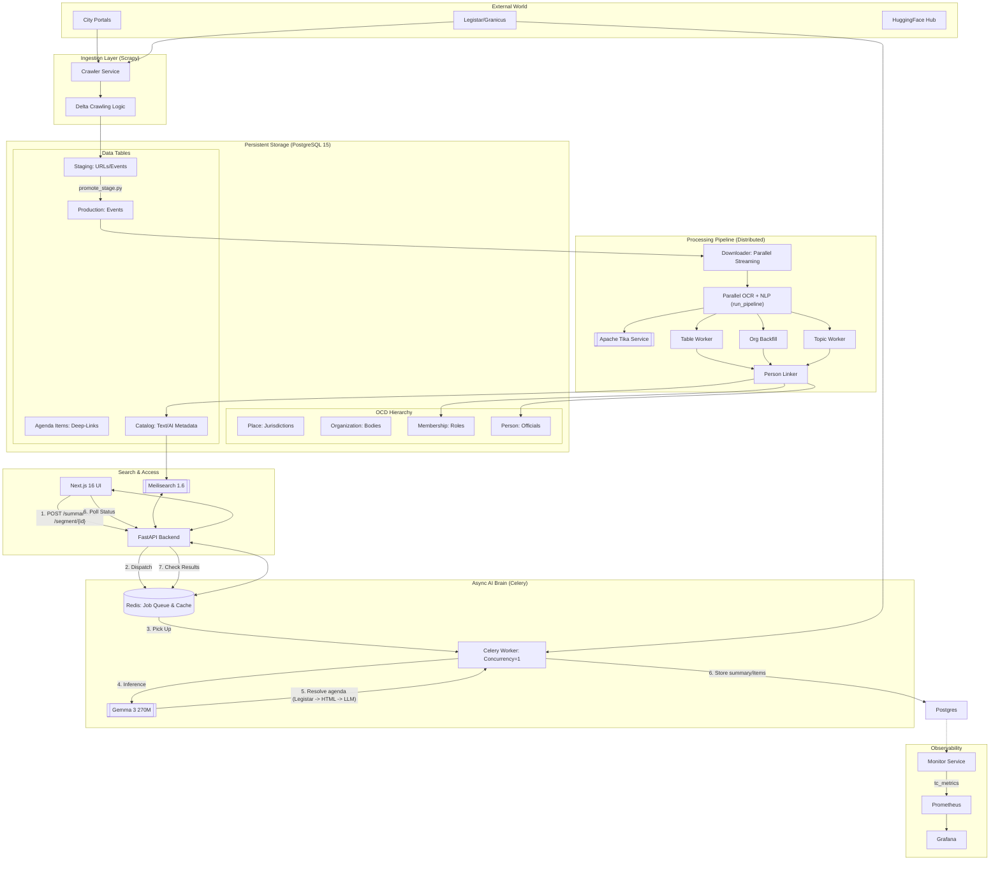

# Modernized Town Council Architecture (2026)

This document provides a technical overview of the system design, focusing on the high-performance data pipeline, structured civic data modeling, and security model.

## System Diagram

## Key Components & Design Principles

### Data Pipeline Flow
The system processes data through a multi-stage verifiable pipeline:
1.  **Crawling:** Scrapy spiders fetch meeting metadata and PDF links from municipal sites.
2.  **Extraction:** Apache Tika extracts raw text and XHTML page markers from PDFs.
3.  **Ground Truth Sync:** A dedicated worker (`ground_truth_sync.py`) fetches official action text and voting results from the **Legistar API**.
4.  **Verification & Alignment:**
    *   **Fuzzy Matching:** Links API items to PDF segments using RapidFuzz algorithms.
    *   **Spatial Anchoring:** Uses **PyMuPDF** to find the exact (x, y) coordinates of votes within the PDF.
    *   **Dual-Source Validation:** Marks records as "Verified" only when the API ground truth and PDF content align spatially.
5.  **Processing:**
    *   **NLP:** SpaCy identifies named entities (People, Organizations).
    *   **AI:** Local LLMs generate summaries and segment agenda items.
6.  **Indexing:** Data is pushed to Meilisearch for low-latency search performance.
*   **Table-Centric (Berkeley):** Directly parses modern city websites using high-precision XPaths.
*   **CivicPlus/Folder-Centric (Dublin):** Navigates standard government platforms that use metadata attributes (like `data-th`) for accessibility.
*   **API-Centric (Cupertino):** Communicates directly with modern platforms like **Legistar Web API**. This provides the highest reliability as it bypasses HTML complexity and bot detection.
*   **Delta Crawling:** All spiders implement a "look-back" check against the database to only fetch meetings that haven't been processed yet.

#### Spider Architecture (BaseCitySpider)
To ensure scalability and maintainability, the scraping layer uses an Object-Oriented **Inheritance Pattern**:
*   **BaseCitySpider (`base.py`):** A robust parent class that handles all infrastructure logic:
    *   **Database Connection:** Automatically connects to PostgreSQL to check for existing data.
    *   **Delta Logic:** Implements `should_skip_meeting(date)` to prevent re-downloading thousands of PDFs.
    *   **Standardization:** Uses a factory method `create_event_item()` to ensure every spider outputs data in the exact same format (OCD Compliant).
*   **Child Spiders (e.g., `ca_dublin.py`):** These are lightweight (often <50 lines) and strictly focused on **Page Parsing**. They inherit all the complex "plumbing" from the base class, making it easy for novice developers to add new cities.

### 2. Structured Data Modeling (OCD Alignment)
The system follows the **Open Civic Data (OCD)** standard to ensure interoperability and accountability:
*   **Jurisdiction (Place):** The geographical scope (e.g., Berkeley, CA).
*   **Organization:** The legislative body or committee (e.g., Planning Commission).
*   **Membership:** The specific role an official holds within an organization.
*   **Person:** A unique identity for an official, tracked across different roles and cities.
    *   **Person Classification:** `person_type` distinguishes `official` records from `mentioned` names extracted by NLP. This prevents non-official mentions from polluting the public officials list.

### 3. Agenda Item Segmentation (Deep-Linking)
To solve the "Needle in a Haystack" problem without city-specific branching, the system uses a shared resolver:
*   **Source Priority (Simple-by-Default):**
    1. **Legistar API** agenda items when `place.legistar_client` is configured
    2. **Generic HTML agenda parser** when an `.html` agenda document exists
    3. **Local LLM fallback** (`Gemma 3 270M`) when structured sources are unavailable
*   **Quality Controls:** Low-quality title sets (header noise, OCR spacing artifacts, duplicate junk) are scored and can trigger async re-generation.
*   **Granular Indexing:** Final items are indexed in Meilisearch as separate, first-class entities.
*   **Benefit:** Search results can point users directly to specific topics while keeping segmentation maintainable across cities.

### 4. Interoperable Identifiers (OCD-ID)
The system implements a standardized identifier generator (`ocd-[type]/[uuid]`) for all core entities:
*   **Avoids IDOR Attacks:** Random UUIDs prevent malicious enumeration of records.
*   **Federation Ready:** By following the OCD standard, the database is interoperable with other civic data projects like *Open States* or *Councilmatic*.

### 5. Local-First AI Strategy (Local Inference)
To ensure privacy, zero cost, and resilience, the system uses a local-inference AI stack for runtime requests. Model assets are downloaded at build time, then inference runs locally.

*   **The Brain (Gemma 3 270M):** We use a 4-bit quantized version of Google's state-of-the-art "micro-model".
    *   **Context Window:** 2,048 tokens (optimized for stability in Docker).
    *   **Size:** ~150MB (Embedded directly in the Docker image).
    *   **Inference Engine:** `llama-cpp-python` compiled with NEON support for high-speed processing on Apple Silicon and AVX2 on x86.
*   **Tasks:**
    *   **Summarization:** Generates 3-bullet executive summaries.
    *   **Agenda Segmentation:** Extracts structured topics and descriptions.
*   **Memory Management:** The AI model is managed by a singleton instance to prevent redundant loads while maintaining thread-safety via locks.

### 6. Concurrency Model
To ensure stability on consumer-grade hardware, the local AI execution is **Serialized**:
*   **Thread Safety:** Since the `llama.cpp` engine shares a single memory buffer, the `LocalAI` class utilizes a `threading.Lock`.
*   **Queueing Logic:** If multiple users trigger AI summaries simultaneously, their requests wait in a thread-safe queue. This prevents RAM exhaustion and "Race Conditions" while maintaining high throughput for search and metadata queries.

### 7. Distributed Task Architecture (Async Workers)
To scale beyond a single server, the system uses a **Producer-Consumer** model for heavy compute tasks:
*   **The Mailbox (Redis):** When a user requests a summary, the API puts a "Job Ticket" into Redis and returns immediately.
*   **The Workers (Celery):** Background worker processes pick up these tickets and perform summarization/segmentation without blocking the main API.
*   **Shared Segmentation Service:** Async task and batch worker both call the same resolver and persistence helpers to prevent duplicated logic and behavior drift.
*   **Parallel Ingestion:** The data pipeline uses `ProcessPoolExecutor` to process multiple PDF documents simultaneously (OCR -> NLP) on all available CPU cores, speeding up nightly updates by 4-8x.

### 7.1 Async Task Failure Behavior (UI Contract)
The frontend polls background task status (`/tasks/{id}`) and now treats both task failures and polling/network errors as terminal states:
*   loading indicators are cleared on error paths
*   users are not left in indefinite "processing" states

### 8. Data Quality Loop (Feedback Mechanism)
To maintain a high-quality dataset at scale, the system implements a **Crowdsourced Audit Loop**:
*   **Reporting API:** A dedicated `POST /report-issue` endpoint allows users to flag problems (e.g., broken PDF links or OCR errors) directly from the UI.
*   **Issue Tracking:** Reported issues are saved to the `data_issue` table, linked to the specific meeting. This allows administrators to prioritize fixes for the most critical data gaps without manually checking thousands of records.

### 8.1 People Quality Guardrails
To keep official profiles trustworthy:
*   NLP name detections are treated as **mentions** unless official evidence exists.
*   Membership links are created for `official` profiles only.
*   The `/people` endpoint filters to `official` records by default and supports an explicit diagnostics mode (`include_mentions=true`).

### 8.2 Performance Architecture (Sub-100ms)
To ensure the platform feels "instant" even on consumer hardware, we use a multi-tiered acceleration strategy:
*   **Caching Layer (Redis):** Frequently accessed data (like City Metadata and Statistics) is stored in RAM using Redis. This offloads 95% of read traffic from the database and delivers results in <5ms.
*   **Turbo JSON (orjson):** The API uses `orjson` (a high-performance Rust library) instead of Python's standard `json` module. This speeds up the serialization of large search results by 3-5x.
*   **Eager Loading:** We solve the "N+1 Query Problem" by using SQLAlchemy's `joinedload`. When you request a Person profile, we fetch their roles, city, and committee memberships in a **single database query** instead of 30+ separate round-trips.
*   **Database Indexing:** Critical columns (`place_id`, `record_date`) are indexed to ensure that filtering 10,000+ meetings takes milliseconds.

### 8.3 Search Indexing Batch Semantics
The Meilisearch indexer uses explicit batch flushing rules:
*   flush on reaching `MEILISEARCH_BATCH_SIZE`
*   flush exactly once for the final partial batch after each phase (documents, agenda items)

This prevents duplicate sends, keeps indexing counts accurate, and avoids unnecessary write amplification.

### 9. Security Model
*   **CORS Restriction:** The API is hardened to only accept requests from the authorized frontend origin (`localhost:3000`).
*   **Dependency Injection:** Database sessions are managed via FastAPI's dependency system, ensuring every connection is strictly closed after a request to prevent connection leaks.
*   **Non-Root Execution:** First-party app containers built from the repo Dockerfiles run as a restricted `appuser`.
*   **Path Traversal Protection:** The `is_safe_path` validator ensures workers only interact with authorized data directories.
*   **Deep Health Checks:** The container orchestrator monitors the `/health` endpoint, which proactively probes the database connection. If the database locks up, the container is automatically restarted.
*   **Frontend Auth Header Discipline:** Browser clients only send `X-API-Key` when `NEXT_PUBLIC_API_AUTH_KEY` is explicitly configured; no hardcoded default key is injected by frontend code.

### 10. Data Integrity & Validation
To prevent "garbage data" from corrupting the system, we enforce strict schemas at multiple layers:
*   **API Layer (Pydantic):** Strict type checking for all JSON inputs.
*   **Logic Layer (Regex):** Custom validators ensure Dates (ISO-8601) and Identifiers (OCD-ID follow strict formats.
*   **Database Layer (Schema):** Metadata columns have explicit length limits (e.g., `VARCHAR(255)`) to prevent buffer stuffing. **High-volume text columns** (Meeting Content, Summaries, Biographies) use the `TEXT` type to ensure zero truncation during ingestion.

### 11. Transaction Safety & Error Handling
To prevent data corruption during network or database failures, all database operations follow strict transaction patterns with production-grade exception handling:

#### Specific Exception Handling (30 instances)
The codebase uses **specific exception types** rather than broad `except Exception` handlers, enabling precise error handling and better debugging:
*   **Database Operations (11 instances):** All database code catches `SQLAlchemyError` to handle integrity violations, connection losses, and transaction failures while letting logic errors (ValueError, KeyError) propagate correctly
*   **Network Operations (3 instances):** HTTP calls catch `requests.RequestException` for timeouts, DNS failures, and connection errors
*   **File I/O (4 instances):** File operations catch `OSError` for permission errors, missing files, and disk full conditions
*   **Search Indexing (4 instances):** Meilisearch operations catch `MeilisearchError` for index locks, timeouts, and invalid document formats
*   **PDF Operations (4 instances):** Camelot table extraction catches specific errors (`ValueError`, `RuntimeError`, `MemoryError`) for malformed PDFs
*   **Topic Modeling (2 instances):** TF-IDF analysis catches `ValueError` for empty documents and `MemoryError` for resource exhaustion
*   **Background Tasks (2 instances):** Celery tasks catch specific errors and leverage task queue retry mechanisms (60s countdown, 3 attempts)

#### Context Manager Pattern
All database operations use the `db_session()` context manager (pipeline/db_session.py) which:
*   **Automatic rollback:** Catches ANY exception (broad is correct here) and rolls back uncommitted changes
*   **Guaranteed cleanup:** Ensures sessions close even if business logic raises errors
*   **Educational comments:** Documents why context managers MUST catch Exception, not just SQLAlchemyError

#### When Broad Exceptions Are Correct (5 instances)
The codebase documents scenarios where broad exception handling is the **correct pattern**:
*   **AI/LLM Operations (3 instances):** llama-cpp-python is an external C++ library that can raise unpredictable exception types; catching Exception is safer than enumerating unknowns
*   **Migration Scripts (2 instances):** Database migrations catch Exception for cross-database compatibility (PostgreSQL, MySQL, SQLite raise different types for "column exists")

#### Rollback Protection
All database commits are wrapped in try/except blocks with explicit rollback() calls:
*   `ground_truth_sync.py`: Rolls back if Legistar API fetch fails mid-transaction, preventing partial vote records
*   `agenda_legistar.py`: Uses explicit timeouts and bounded retries for Legistar cross-check requests and fails soft to HTML/LLM sources if remote calls fail
*   `verification_service.py`: Rolls back if spatial coordinate lookup fails during PDF verification
*   `downloader.py`: Handles race conditions when multiple workers download the same file
*   `promote_stage.py`: Rolls back if event promotion fails, keeping staging/production in sync

#### Staging Archive Safety
Downloader staging rows are archived selectively:
*   rows that were processed successfully are moved to `url_stage_hist`
*   failed rows remain in `url_stage` for retry on the next run

This avoids silent data loss when network/download failures occur mid-batch.

#### Thread-Safe Model Loading
The LocalAI singleton uses double-checked locking to prevent race conditions:
*   First check: Fast path without lock (if model is already loaded, return immediately)
*   Second check: Inside lock to prevent duplicate loads if multiple threads arrive simultaneously
*   Model loading happens entirely within the lock to prevent multiple threads from loading the 500MB model simultaneously

#### Educational Documentation
Every exception handler includes beginner-friendly comments (500+ lines) explaining:
*   **What can fail:** Specific error scenarios with real examples

### 12. Test Strategy and Reliability Gates
The project now follows a pipeline-first testing strategy because most risk lives in ingestion and processing, not UI rendering.

*   **Coverage by area (current baseline):**
    * `pipeline/*` is the primary focus area and receives the majority of new tests.
    * `api/*` and crawler coverage remain important, but they are secondary to pipeline correctness.
*   **Test tiers:**
    * Unit tests for pure logic and validators.
    * Integration tests for stage -> promote -> process -> link flows.
    * Migration tests for schema/backfill/idempotent rerun behavior.
    * Benchmark tests for regression visibility.
*   **Runtime compatibility policy:**
    * NLP-dependent modules use lazy loading and clear runtime errors when the stack is unavailable.
    * NLP tests are deterministic in the current suite and are expected to run in CI.
*   **CI expectations:**
    * No collection errors.
    * No regression below locked baseline coverage.
    * Artifact files (`file:testdb`, benchmark outputs) are not committed.

### 13. Container Optimization & Performance
To ensure fast developer iteration and secure production deployments, the system uses an optimized Docker architecture:
*   **Multi-Stage Builds:** Separates build-time dependencies (compilers, headers) from the final runtime image, reducing the attack surface and image size.
*   **BuildKit Cache Mounts:** Utilizes `--mount=type=cache` for both Python (pip) and Node.js (npm). This allows the system to cache package downloads across builds, making repeated installs up to 10x faster.
*   **Next.js Standalone Mode:** The frontend utilizes Next.js output tracing to create a minimal production server that only carries the absolute necessary files, resulting in a ~1GB reduction in image size.
*   **Strict Layering:** Dockerfiles are structured to copy dependency files (`requirements.txt`, `package.json`) before source code, maximizing layer reuse.

### 14. High-Performance Search & UX
*   **Unified Search Hub:** A segmented search bar integrating Keyword, Municipality, Body, and Type filters.
*   **Yield-Based Indexing:** The Meilisearch indexer uses Python's `yield_per` pattern to stream hundreds of thousands of documents with minimal memory footprint.
*   **Tiered Inspection:** A 3-tier UI flow (Snippet -> Full Text -> AI Insights) manages cognitive load.

### 15. AI Strategy
*   **On-Demand Summarization:** To prevent unnecessary CPU load, summaries are only generated when requested by a user in the UI.
*   **Caching:** AI responses are permanently saved to the `catalog` table, making subsequent views instant and cost-free.
*   **Grounding:** Models use a temperature of 0.1 and strict instructional grounding to eliminate hallucinations.

### 16. Resilience & Fail-Soft Logic
To ensure 24/7 availability in production, the system implements **Graceful Degradation**:
*   **Dependency Checking:** The API uses a `is_db_ready()` helper to verify the database connection before handling requests. If the database is down, it returns a `503 Service Unavailable` error instead of crashing.
*   **Lazy AI Loading:** Local AI models are loaded only when first requested. If the model files are missing or corrupt, the API continues to serve search results while disabling only the summarization and segmentation features.
*   **Robust Segment Extraction:** The system uses a multi-layered approach for agenda splitting:
    1.  **Direct AI Extraction:** High-precision bulleted list from the local model.
    2.  **Paragraph Fallback:** If the AI output is malformed, the system automatically segments by paragraph to ensure the UI remains functional.

### 17. Performance Guardrails
To prevent "Speed Regressions" during development, the system implements automated performance monitoring:
*   **Continuous Benchmarking:** Every compute-heavy function (Fuzzy Matching, Regex Parsing) is tracked via `pytest-benchmark`. If a change makes an algorithm 2x slower, the benchmark suite will highlight the regression.
*   **Traffic Simulation:** We use **Locust** to simulate high-concurrency scenarios. This allows us to verify that our Redis caching and Meilisearch optimizations actually scale to 50+ concurrent users on standard hardware.
*   **Payload Monitoring:** The API is configured to strictly control response sizes (via `attributesToRetrieve`), ensuring that search results remain under 100KB regardless of document size.

### 18. Municipal NLP Guardrails (The Triple Filter)
To ensure high precision in identifying officials, the system uses a 3-layer NLP filtering strategy:
1.  **Boilerplate Pre-emptor (Pre-NER):** An `EntityRuler` explicitly tags common municipal noise ("Item 1", "City Clerk") *before* the AI runs, preventing misidentification.
2.  **Title-Aware Confidence:** Patterns like "Mayor [Name]" or "Moved by [Name]" are used to identify people even if the statistical model is uncertain.
3.  **Heuristic Bouncer (Post-NER):** A custom component scrubs every `PERSON` entity against "Nuclear Precision" human-name heuristics:
    *   **Tech-Character Block:** Discards strings with web-symbols (`@`, `://`).
    *   **Smart Blacklisting:**
        *   **Total Noise:** Uses word-boundary regex (`\bca\b`, `\bclerk\b`) to block municipal boilerplate without filtering legitimate names like "Catherine".
        *   **Contextual Noise:** Blocks common municipal words like "Park", "Staff", or "Street" only if they appear as single words without a trusted title. This preserves names like "Linda Park" or "Michael Staff".
    *   **Vowel Density Check:** Discards OCR fragments (e.g., "Spl Tax Bds") by enforcing a minimum vowel density (10-25%).
    *   **Linguistic Check:** Discards entities without a Proper Noun (`PROPN`) signal.

### 19. Security Advisories

#### Known Dependency Vulnerabilities (Accepted Risk)

**CVE-2017-14158 (Scrapy DoS) - Dismissed February 2026**
*   **Status:** Accepted Risk (Not Vulnerable)
*   **Severity:** High (CVSS 7.5/10)
*   **Affected Component:** Scrapy FilesPipeline/ImagesPipeline (memory exhaustion via large file downloads)
*   **Our Status:** Not Vulnerable - We do not use the affected components
*   **Rationale:**
    *   Our custom Scrapy pipelines only process metadata (meeting names, dates, PDF URLs)
    *   We do not use FilesPipeline or ImagesPipeline which are the vulnerable components
    *   PDF downloads happen separately in the pipeline worker, not during Scrapy crawling
    *   We have `DOWNLOAD_MAXSIZE=104857600` (100MB) configured to prevent memory exhaustion attacks
*   **Mitigation:** Download size limits enforced in `council_crawler/council_crawler/settings.py`
*   **Reference:** https://github.com/scrapy/scrapy/issues/482
