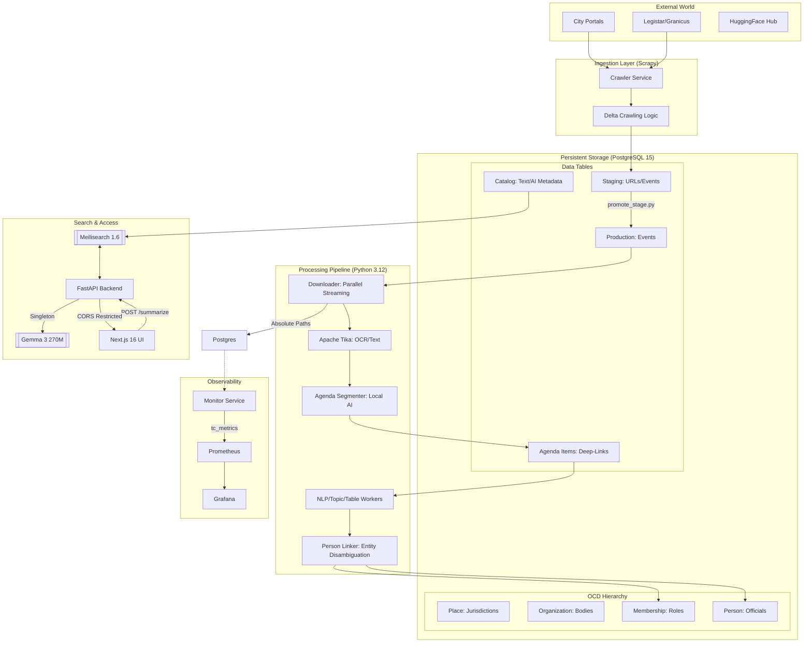

# Modernized Town Council Architecture (2026)

This document provides a technical overview of the system design, focusing on the high-performance data pipeline, structured civic data modeling, and security model.

## System Diagram

## Key Components & Design Principles

### 1. Ingestion Layer (Scrapy)
The system utilizes city-specific spiders to handle municipal website volatility. It supports multiple portal architectures:
*   **Table-Centric (Berkeley):** Directly parses modern city websites using high-precision XPaths.
*   **CivicPlus/Folder-Centric (Dublin):** Navigates standard government platforms that use metadata attributes (like `data-th`) for accessibility.
*   **API-Centric (Cupertino):** Communicates directly with modern platforms like **Legistar Web API**. This provides the highest reliability as it bypasses HTML complexity and bot detection.
*   **Delta Crawling:** All spiders implement a "look-back" check against the database to only fetch meetings that haven't been processed yet.

#### Spider Architecture (BaseCitySpider)
To ensure scalability and maintainability, the scraping layer uses an Object-Oriented **Inheritance Pattern**:
*   **BaseCitySpider (`base.py`):** A robust parent class that handles all infrastructure logic:
    *   **Database Connection:** Automatically connects to PostgreSQL to check for existing data.
    *   **Delta Logic:** Implements `should_skip_meeting(date)` to prevent re-downloading thousands of PDFs.
    *   **Standardization:** Uses a factory method `create_event_item()` to ensure every spider outputs data in the exact same format (OCD Compliant).
*   **Child Spiders (e.g., `ca_dublin.py`):** These are lightweight (often <50 lines) and strictly focused on **Page Parsing**. They inherit all the complex "plumbing" from the base class, making it easy for novice developers to add new cities.

### 2. Structured Data Modeling (OCD Alignment)
The system follows the **Open Civic Data (OCD)** standard to ensure interoperability and accountability:
*   **Jurisdiction (Place):** The geographical scope (e.g., Berkeley, CA).
*   **Organization:** The legislative body or committee (e.g., Planning Commission).
*   **Membership:** The specific role an official holds within an organization.
*   **Person:** A unique identity for an official, tracked across different roles and cities.

### 3. Agenda Item Segmentation (Deep-Linking)
To solve the "Needle in a Haystack" problem, the system uses an AI-driven segmentation worker:
*   **Splitting Logic:** Local **Gemma 3 270M** reads the OCR text and identifies individual agenda items. 
*   **Robustness:** The system uses a **Regex-based parser** to extract items from structured AI text, with a **fail-soft fallback** that splits by paragraph if the AI fails to find topics.
*   **Granular Indexing:** These items are indexed in Meilisearch as separate, first-class entities.
*   **Benefit:** Search results can point users directly to the specific 1-page section of a 500-page packet, significantly improving accessibility.

### 4. Interoperable Identifiers (OCD-ID)
The system implements a standardized identifier generator (`ocd-[type]/[uuid]`) for all core entities:
*   **Avoids IDOR Attacks:** Random UUIDs prevent malicious enumeration of records.
*   **Federation Ready:** By following the OCD standard, the database is interoperable with other civic data projects like *Open States* or *Councilmatic*.

### 5. Local-First AI Strategy (Air-Gapped)
To ensure privacy, zero cost, and resilience, the system uses a **100% Local AI** stack. No data is ever sent to the cloud.

*   **The Brain (Gemma 3 270M):** We use a 4-bit quantized version of Google's state-of-the-art "micro-model".
    *   **Context Window:** 2,048 tokens (optimized for stability in Docker).
    *   **Size:** ~150MB (Embedded directly in the Docker image).
    *   **Inference Engine:** `llama-cpp-python` compiled with NEON support for high-speed processing on Apple Silicon and AVX2 on x86.
*   **Tasks:**
    *   **Summarization:** Generates 3-bullet executive summaries.
    *   **Agenda Segmentation:** Extracts structured topics and descriptions.
*   **Memory Management:** The AI model is managed by a singleton instance to prevent redundant loads while maintaining thread-safety via locks.

### 6. Concurrency Model
To ensure stability on consumer-grade hardware, the local AI execution is **Serialized**:
*   **Thread Safety:** Since the `llama.cpp` engine shares a single memory buffer, the `LocalAI` class utilizes a `threading.Lock`.
*   **Queueing Logic:** If multiple users trigger AI summaries simultaneously, their requests wait in a thread-safe queue. This prevents RAM exhaustion and "Race Conditions" while maintaining high throughput for search and metadata queries.

### 7. Distributed Task Architecture (Async Workers)
To scale beyond a single server, the system uses a **Producer-Consumer** model for heavy compute tasks:
*   **The Mailbox (Redis):** When a user requests a summary, the API puts a "Job Ticket" into Redis and returns immediately.
*   **The Workers (Celery):** Background worker processes pick up these tickets and perform the heavy AI lifting (Summarization, Segmentation) without blocking the main API.
*   **Parallel Ingestion:** The data pipeline uses `ProcessPoolExecutor` to process multiple PDF documents simultaneously (OCR -> NLP) on all available CPU cores, speeding up nightly updates by 4-8x.

### 8. Data Quality Loop (Feedback Mechanism)
To maintain a high-quality dataset at scale, the system implements a **Crowdsourced Audit Loop**:
*   **Reporting API:** A dedicated `POST /report-issue` endpoint allows users to flag problems (e.g., broken PDF links or OCR errors) directly from the UI.
*   **Issue Tracking:** Reported issues are saved to the `data_issue` table, linked to the specific meeting. This allows administrators to prioritize fixes for the most critical data gaps without manually checking thousands of records.

### 8. Performance Architecture (Sub-100ms)
To ensure the platform feels "instant" even on consumer hardware, we use a multi-tiered acceleration strategy:
*   **Caching Layer (Redis):** Frequently accessed data (like City Metadata and Statistics) is stored in RAM using Redis. This offloads 95% of read traffic from the database and delivers results in <5ms.
*   **Turbo JSON (orjson):** The API uses `orjson` (a high-performance Rust library) instead of Python's standard `json` module. This speeds up the serialization of large search results by 3-5x.
*   **Eager Loading:** We solve the "N+1 Query Problem" by using SQLAlchemy's `joinedload`. When you request a Person profile, we fetch their roles, city, and committee memberships in a **single database query** instead of 30+ separate round-trips.
*   **Database Indexing:** Critical columns (`place_id`, `record_date`) are indexed to ensure that filtering 10,000+ meetings takes milliseconds.

### 9. Security Model
*   **CORS Restriction:** The API is hardened to only accept requests from the authorized frontend origin (`localhost:3000`).
*   **Dependency Injection:** Database sessions are managed via FastAPI's dependency system, ensuring every connection is strictly closed after a request to prevent connection leaks.
*   **Non-Root Execution:** All Docker containers run as a restricted `appuser`.
*   **Path Traversal Protection:** The `is_safe_path` validator ensures workers only interact with authorized data directories.
*   **Deep Health Checks:** The container orchestrator monitors the `/health` endpoint, which proactively probes the database connection. If the database locks up, the container is automatically restarted.

### 10. Data Integrity & Validation
To prevent "garbage data" from corrupting the system, we enforce strict schemas at multiple layers:
*   **API Layer (Pydantic):** Strict type checking for all JSON inputs.
*   **Logic Layer (Regex):** Custom validators ensure Dates (ISO-8601) and Identifiers (OCD-ID follow strict formats.
*   **Database Layer (Schema):** Metadata columns have explicit length limits (e.g., `VARCHAR(255)`) to prevent buffer stuffing. **High-volume text columns** (Meeting Content, Summaries, Biographies) use the `TEXT` type to ensure zero truncation during ingestion.

### 11. Container Optimization & Performance
To ensure fast developer iteration and secure production deployments, the system uses an optimized Docker architecture:
*   **Multi-Stage Builds:** Separates build-time dependencies (compilers, headers) from the final runtime image, reducing the attack surface and image size.
*   **BuildKit Cache Mounts:** Utilizes `--mount=type=cache` for both Python (pip) and Node.js (npm). This allows the system to cache package downloads across builds, making repeated installs up to 10x faster.
*   **Next.js Standalone Mode:** The frontend utilizes Next.js output tracing to create a minimal production server that only carries the absolute necessary files, resulting in a ~1GB reduction in image size.
*   **Strict Layering:** Dockerfiles are structured to copy dependency files (`requirements.txt`, `package.json`) before source code, maximizing layer reuse.

### 11. High-Performance Search & UX
*   **Unified Search Hub:** A segmented search bar integrating Keyword, Municipality, Body, and Type filters.
*   **Yield-Based Indexing:** The Meilisearch indexer uses Python's `yield_per` pattern to stream hundreds of thousands of documents with minimal memory footprint.
*   **Tiered Inspection:** A 3-tier UI flow (Snippet -> Full Text -> AI Insights) manages cognitive load.

### 12. AI Strategy
*   **On-Demand Summarization:** To prevent unnecessary CPU load, summaries are only generated when requested by a user in the UI.
*   **Caching:** AI responses are permanently saved to the `catalog` table, making subsequent views instant and cost-free.
*   **Grounding:** Models use a temperature of 0.1 and strict instructional grounding to eliminate hallucinations.

### 13. Resilience & Fail-Soft Logic
To ensure 24/7 availability in production, the system implements **Graceful Degradation**:
*   **Dependency Checking:** The API uses a `is_db_ready()` helper to verify the database connection before handling requests. If the database is down, it returns a `503 Service Unavailable` error instead of crashing.
*   **Lazy AI Loading:** Local AI models are loaded only when first requested. If the model files are missing or corrupt, the API continues to serve search results while disabling only the summarization and segmentation features.
*   **Robust Segment Extraction:** The system uses a multi-layered approach for agenda splitting:
    1.  **Direct AI Extraction:** High-precision bulleted list from the local model.
    2.  **Paragraph Fallback:** If the AI output is malformed, the system automatically segments by paragraph to ensure the UI remains functional.