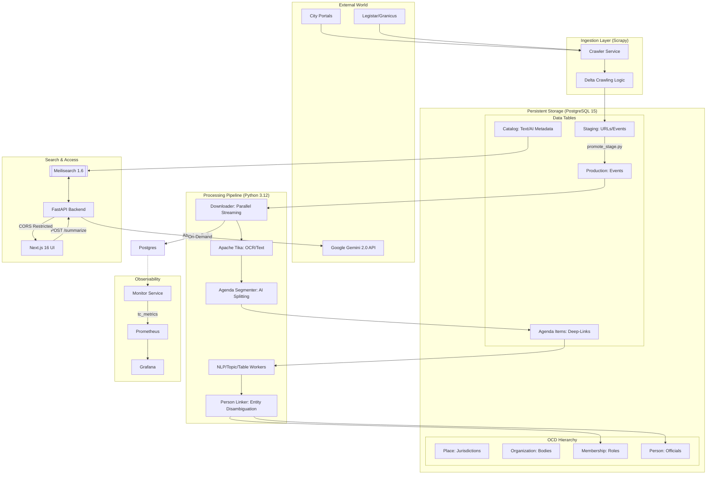

# Modernized Town Council Architecture (2026)

This document provides a technical overview of the system design, focusing on the high-performance data pipeline, structured civic data modeling, and security model.

## System Diagram

## Key Components & Design Principles

### 1. Ingestion Layer (Scrapy)
The system utilizes city-specific spiders to handle municipal website volatility. It supports multiple portal architectures:
*   **Table-Centric (Berkeley):** Directly parses modern city websites using high-precision XPaths.
*   **CivicPlus/Folder-Centric (Dublin):** Navigates standard government platforms that use metadata attributes (like `data-th`) for accessibility.
*   **API-Centric (Cupertino):** Communicates directly with modern platforms like **Legistar Web API**. This provides the highest reliability as it bypasses HTML complexity and bot detection.
*   **Delta Crawling:** All spiders implement a "look-back" check against the database to only fetch meetings that haven't been processed yet.

#### Spider Architecture (BaseCitySpider)
To ensure scalability and maintainability, the scraping layer uses an Object-Oriented **Inheritance Pattern**:
*   **BaseCitySpider (`base.py`):** A robust parent class that handles all infrastructure logic:
    *   **Database Connection:** Automatically connects to PostgreSQL to check for existing data.
    *   **Delta Logic:** Implements `should_skip_meeting(date)` to prevent re-downloading thousands of PDFs.
    *   **Standardization:** Uses a factory method `create_event_item()` to ensure every spider outputs data in the exact same format (OCD Compliant).
*   **Child Spiders (e.g., `ca_dublin.py`):** These are lightweight (often <50 lines) and strictly focused on **Page Parsing**. They inherit all the complex "plumbing" from the base class, making it easy for novice developers to add new cities.

### 2. Structured Data Modeling (OCD Alignment)
The system follows the **Open Civic Data (OCD)** standard to ensure interoperability and accountability:
*   **Jurisdiction (Place):** The geographical scope (e.g., Berkeley, CA).
*   **Organization:** The legislative body or committee (e.g., Planning Commission).
*   **Membership:** The specific role an official holds within an organization.
*   **Person:** A unique identity for an official, tracked across different roles and cities.

### 3. Agenda Item Segmentation (Deep-Linking)
To solve the "Needle in a Haystack" problem, the system uses an AI-driven segmentation worker:
*   **Splitting Logic:** Gemini 2.0 Flash reads the full OCR text and identifies individual agenda items, extracting titles, descriptions, and results (e.g., "Passed").
*   **Granular Indexing:** These items are indexed in Meilisearch as separate, first-class entities.
*   **Benefit:** Search results can point users directly to the specific 1-page section of a 500-page packet, significantly improving accessibility.

### 4. Interoperable Identifiers (OCD-ID)
The system implements a standardized identifier generator (`ocd-[type]/[uuid]`) for all core entities:
*   **Avoids IDOR Attacks:** Random UUIDs prevent malicious enumeration of records.
*   **Federation Ready:** By following the OCD standard, the database is interoperable with other civic data projects like *Open States* or *Councilmatic*.

### 5. Hybrid AI/ML Strategy (Entity Resolution & Summarization)
To balance performance and cost, the system utilizes a **Hybrid Strategy**:
*   **Tier 1 (Local/Extractive):** 
    *   **Entity Resolution:** Uses the **Levenshtein Distance** algorithm (via RapidFuzz) to resolve similar names.
    *   **Summarization:** Uses **TextRank** (via SpaCy/PyTextRank) to identify the 3 most central sentences in a document.
    *   **Topic Discovery:** Uses the **all-MiniLM-L6-v2** Transformer model to generate dense vector embeddings. This identifies concepts that are mathematically related (e.g., 'housing' and 'zoning') even if they share no keywords.
    *   **Semantic Linking:** Utilizes the **FAISS (Facebook AI Similarity Search)** library for high-performance vector retrieval. Instead of a slow $O(N^2)$ matrix, the system builds an optimized index to find related meetings in milliseconds, ensuring scalability to hundreds of thousands of documents.
*   **Tier 2 (Cloud/Generative):** 
    *   Complex tasks like high-quality bulleted summarization and agenda segmentation use **Gemini 2.0 Flash**. These are triggered on-demand by the user to minimize token usage and avoid rate limits.
*   **Blocking:** Name comparisons are "blocked" by city to ensure the algorithm scales without slowing down.

### 6. Data Quality Loop (Feedback Mechanism)
To maintain a high-quality dataset at scale, the system implements a **Crowdsourced Audit Loop**:
*   **Reporting API:** A dedicated `POST /report-issue` endpoint allows users to flag problems (e.g., broken PDF links or OCR errors) directly from the UI.
*   **Issue Tracking:** Reported issues are saved to the `data_issue` table, linked to the specific meeting. This allows administrators to prioritize fixes for the most critical data gaps without manually checking thousands of records.

### 7. Security Model
*   **CORS Restriction:** The API is hardened to only accept requests from the authorized frontend origin (`localhost:3000`).
*   **Dependency Injection:** Database sessions are managed via FastAPI's dependency system, ensuring every connection is strictly closed after a request to prevent connection leaks.
*   **Non-Root Execution:** All Docker containers run as a restricted `appuser`.
*   **Path Traversal Protection:** The `is_safe_path` validator ensures workers only interact with authorized data directories.

### 8. Container Optimization & Performance
To ensure fast developer iteration and secure production deployments, the system uses an optimized Docker architecture:
*   **Multi-Stage Builds:** Separates build-time dependencies (compilers, headers) from the final runtime image, reducing the attack surface and image size.
*   **BuildKit Cache Mounts:** Utilizes `--mount=type=cache` for both Python (pip) and Node.js (npm). This allows the system to cache package downloads across builds, making repeated installs up to 10x faster.
*   **Next.js Standalone Mode:** The frontend utilizes Next.js output tracing to create a minimal production server that only carries the absolute necessary files, resulting in a ~1GB reduction in image size.
*   **Strict Layering:** Dockerfiles are structured to copy dependency files (`requirements.txt`, `package.json`) before source code, maximizing layer reuse.

### 9. High-Performance Search & UX
*   **Unified Search Hub:** A segmented search bar integrating Keyword, Municipality, Body, and Type filters.
*   **Yield-Based Indexing:** The Meilisearch indexer uses Python's `yield_per` pattern to stream hundreds of thousands of documents with minimal memory footprint.
*   **Tiered Inspection:** A 3-tier UI flow (Snippet -> Full Text -> AI Insights) manages cognitive load.

### 10. AI Strategy
*   **On-Demand Summarization:** To prevent `429 Rate Limit` errors, summaries are only generated when requested by a user in the UI.
*   **Caching:** AI responses are permanently saved to the `catalog` table, making subsequent views instant and cost-free.
*   **Grounding:** Models use a temperature of 0.0 and strict instructional grounding to eliminate hallucinations.

