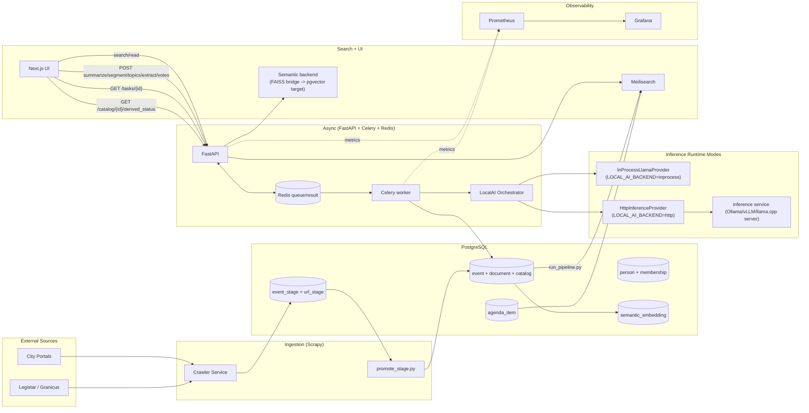

# Town Council Architecture (2026)

Last updated: 2026-04-06

## 1) System Overview

### Purpose and Scope

This document defines stable architecture intent, trust/data boundaries, and contributor-facing contracts.
Operational tuning, rollout state, and troubleshooting are maintained in:
- [`docs/OPERATIONS.md`](docs/OPERATIONS.md)
- [`docs/PERFORMANCE.md`](docs/PERFORMANCE.md)
- [`ROADMAP.md`](ROADMAP.md) (canonical milestone status and sequencing)

### Design Principles

- Local-first by default for contributor workflows.
- Remote inference acceleration is personal opt-in only.
- Remote inference is fail-fast when unreachable.
- Read/search paths are isolated from write-heavy AI generation.
- Durable contracts are deterministic and explicit (API/data/metrics).

### What Town Council Is Not

- Not a system that silently falls back from remote inference to local inference.
- Not a baseline model-cascading system by default.
- Not the operator runbook; this file does not duplicate `docs/OPERATIONS.md` commands.

### Canonical Boundaries

- Product/system entrypoint: [`README.md`](README.md)
- Stable architecture intent and contracts: this file (`ARCHITECTURE.md`)
- Pipeline behavior and rationale walkthrough: [`docs/PIPELINE.md`](docs/PIPELINE.md)
- Policy constraints and defaults: [`AGENTS.md`](AGENTS.md)
- Operations and run procedures: [`docs/OPERATIONS.md`](docs/OPERATIONS.md)
- Performance numbers and reproducibility: [`docs/PERFORMANCE.md`](docs/PERFORMANCE.md)
- Milestone sequencing/status: [`ROADMAP.md`](ROADMAP.md)

## 2) System Design

### System and Trust Boundaries

#### External inputs
- Municipal meeting portals (HTML tables/pages)
- Legistar/Granicus APIs and feeds

#### Internal services
- `crawler` (Scrapy ingestion)
- `pipeline` (batch enrichment and indexing)
- `api` (FastAPI read/write endpoints)
- `frontend` server-side route handlers (same-origin proxy for protected write actions)
- `worker` (Celery async task execution)
- `inference` (HTTP LLM service when `LOCAL_AI_BACKEND=http`)
- `postgres` (system of record, including semantic and lineage data)
- `redis` (Celery queue/result backend + provider metrics aggregation)
- `meilisearch` (lexical search index)
- `prometheus` + `grafana` (observability)

### Topology Diagram

```mermaid
flowchart LR
    subgraph Sources["External Sources"]
        Web["City Portals"]
        Legi["Legistar / Granicus"]
    end

    subgraph Crawl["Ingestion (Scrapy)"]
        Spider["Crawler Service"]
        Promote["promote_stage.py"]
    end

    subgraph DB["PostgreSQL"]
        Stage[("event_stage + url_stage")]
        Core[("event + document + catalog")]
        Agenda[("agenda_item")]
        People[("person + membership")]
        Sem[("semantic_embedding")]
    end

    subgraph Async["Async (FastAPI + Celery + Redis)"]
        API["FastAPI"]
        Queue[("Redis queue/result")]
        Worker["Celery worker"]
        LocalAI["LocalAI Orchestrator"]
    end

    subgraph Inference["Inference Runtime Modes"]
        InProc["InProcessLlamaProvider\n(LOCAL_AI_BACKEND=inprocess)"]
        HttpProv["HttpInferenceProvider\n(LOCAL_AI_BACKEND=http)"]
        HttpSvc["inference service (Ollama/vLLM/llama.cpp server)"]
    end

    subgraph Search["Search + UI"]
        Meili["Meilisearch"]
        Semantic["Semantic backend\n(FAISS bridge -> pgvector target)"]
        UI["Next.js UI"]
    end

    subgraph Obs["Observability"]
        Prom["Prometheus"]
        Graf["Grafana"]
    end

    Web --> Spider
    Legi --> Spider
    Spider --> Stage --> Promote --> Core

    Core -->|"run_pipeline.py"| Meili
    Core --> Sem
    Agenda --> Meili

    UI -->|"search/read"| API
    API --> Meili
    API --> Semantic
    UI -->|"POST summarize/segment/topics/extract/votes"| API
    API <--> Queue --> Worker --> LocalAI
    LocalAI --> InProc
    LocalAI --> HttpProv --> HttpSvc
    Worker --> Core
    UI -->|"GET /tasks/{id}"| API
    UI -->|"GET /catalog/{id}/derived_status"| API

    API -. metrics .-> Prom
    Worker -. metrics .-> Prom
    Prom --> Graf
```

### Core Data Flows

#### Ingestion and normalization
1. Crawler writes meeting metadata and document URLs into staging tables.
2. Promotion creates canonical `event` and `document` rows.
3. Downloader stores files and links them to `catalog`.
4. Some crawler source families apply shared recovery behavior before rows ever reach promotion:
   - Legistar CMS spiders can widen the visible historical window before parsing.
   - city-scoped recovery can opt into no-delta crawling when an operator needs a bounded historical backfill instead of the normal stored anchor.

#### Batch enrichment
1. Extraction writes canonical text to `catalog.content` and computes `content_hash`.
2. Agenda segmentation and summary hydration derive structured agenda state and summary state from the extracted corpus.
3. Entity/topic/org/people stages enrich records after the core derived states exist.
4. Search freshness is maintained through both broad batch hydration and task-driven targeted reindex of changed catalogs.
5. Semantic embedding hydration populates `semantic_embedding`.
6. Maintenance hydration has three supported paths with different scopes:
   - `pipeline/run_pipeline.py` for broad corpus hydration
   - staged city hydration for large unresolved city backlogs
   - repaired-city hydration for city-scoped recovered agenda catalogs that still need extract/segment/summary work

#### City onboarding and rollout evaluation
1. `scripts/onboard_city_wave.sh` runs wave-scoped crawl attempts and records per-run artifacts.
2. Crawl success requires city-attributable staging evidence, not just a zero spider exit code.
3. Onboarding-scoped extraction processes only the run's touched catalogs that still need work, instead of waking the full backlog.
4. City-scoped agenda segmentation is attempted before gate evaluation.
5. `scripts/evaluate_city_onboarding.py` grades extraction and segmentation against the run-window touched corpus for that city, while keeping historical totals as diagnostic context.
6. Previously passing delta-crawl cities may confirm through an explicit stable-no-op path when the crawler succeeds but the live portal has no newer rows than the stored crawl anchor; this path is auditable and does not weaken first-time onboarding requirements.
7. Rollout wave membership and enabled-city state live in `city_metadata/city_rollout_registry.csv`, separate from static city source metadata in `city_metadata/list_of_cities.csv`.

#### Async user-triggered generation
1. UI calls protected write endpoints.
2. Frontend server-side route handlers forward protected mutations with `API_AUTH_KEY`; the browser does not hold a public write key.
3. API enqueues Celery tasks in Redis.
4. Worker executes task and persists updates.
5. UI polls `/tasks/{id}` with bounded retry logic.

Trust note:
- protected frontend mutations now rely on server-side Next route handlers configured with `INTERNAL_API_BASE_URL` and `API_AUTH_KEY`
- `NEXT_PUBLIC_API_AUTH_KEY` is not part of the current stable contract

### Domain Design Summaries

#### Agenda Segmentation (Stable)

Source priority:
1. Legistar agenda items when `place.legistar_client` exists
2. Generic HTML agenda parsing
3. Local LLM fallback with deterministic acceptance gates

Key safeguards:
- procedural/contact boilerplate suppression
- TOC/body duplicate suppression
- context-aware page boundary handling
- deterministic rejection for low-substance candidates

Primary owners:
- `pipeline/llm.py`
- `pipeline/agenda_resolver.py`

#### Vote Extraction (Stable)

Vote extraction is intentionally separated from segmentation so outcome parsing failures do not roll back item creation.

Flow:
1. Segment agenda/minutes into `agenda_item` rows.
2. Run vote extraction over item-level context.
3. Validate output against strict JSON contract.
4. Persist high-confidence, non-ambiguous outcomes.

Write hierarchy:
- `manual` and `legistar` sources are authoritative and never overwritten by LLM extraction.
- LLM extraction backfills unknown/empty fields unless forced.

Primary owners:
- `pipeline/tasks.py`
- `pipeline/models.py`

#### Semantic Search (Transitional, meeting-level Phase 2)

- `GET /search/semantic` is additive; keyword `/search` remains stable.
- `/search?semantic=true` enables hybrid semantic reranking on the main search endpoint.
- pgvector Phase 2 is intentionally meeting-level:
  - lexical recall comes from Meilisearch
  - pgvector reranks meeting candidates only
  - agenda-item semantic retrieval is deferred
- Retrieval over-fetches candidates and de-duplicates by `catalog_id` before pagination.
- If pgvector embeddings are missing or stale for the recalled meetings, semantic mode degrades to lexical results and reports why in `semantic_diagnostics`.
- FAISS is a temporary bridge path while pgvector is hydrated and validated.

Primary owners:
- `api/main.py`
- `api/search_routes.py`
- `pipeline/semantic_index.py`
- `pipeline/db_migrate.py`
- `pipeline/migrate_v8.py`

#### Lineage + Trends (Stable)

- Meeting-level lineage persists in `catalog.lineage_*`.
- Lineage recompute runs as a Celery task with advisory-lock single-writer semantics.
- Trends endpoints derive from Meilisearch facets in v1 (no SQL trend-cache layer).
- QueryBuilder contract is shared to avoid filter drift between search and trends.

Primary owners:
- `pipeline/lineage_service.py`
- `pipeline/tasks.py`
- `api/main.py`
- `api/search_routes.py`
- `api/search/query_builder.py`

#### Inference Provider Architecture (Stable baseline + Experimental future)

- `LocalAI` handles orchestration (prompting, grounding, fallback policy).
- Transport is abstracted behind `InferenceProvider`:
  - `InProcessLlamaProvider`
  - `HttpInferenceProvider`
- Providers emit typed errors (`ProviderTimeoutError`, `ProviderUnavailableError`, `ProviderResponseError`) so orchestration can distinguish retryable paths from deterministic fallback paths.
- Under prefork workers, provider telemetry is mirrored to Redis-backed aggregates so `tc_provider_*` series remain visible.

Hardware topology:
- Baseline is local-first: worker and inference runtime are co-located on contributor machines.
- Optional personal acceleration can point `HttpInferenceProvider` at a remote HTTP endpoint (for example, within a private tailnet).
- Remote acceleration is fail-fast if unreachable; there is no silent fallback between remote and local modes.

Future direction (Experimental, non-baseline):
- Compute triage/model cascading may be introduced in future roadmap phases, but it is not baseline policy today.
- Baseline defaults remain 270M-first and local-first unless roadmap/runbook policy explicitly changes.

Primary owners:
- `pipeline/llm.py`
- `pipeline/llm_provider.py`
- `pipeline/config.py`

### Stability Zones

- `Stable`: service boundaries, async task split, API/data/metrics contracts, local-first/fail-fast policy.
- `Transitional`: FAISS bridge while pgvector hydration/validation completes.
- `Experimental`: future compute triage/model cascading (not baseline).

## 3) Contributor Map

### Entry Points by Task

- Add or modify async generation endpoint:
  - `api/main.py` (app facade and compatibility surface)
  - `api/task_routes.py` (route + task dispatch)
  - `pipeline/tasks.py` (Celery task logic)
  - `frontend/components/ResultCard.js` (polling/status UI)
- Adjust lineage recompute behavior:
  - `pipeline/lineage_service.py`
  - `pipeline/tasks.py`
  - `api/main.py` (exposed lineage/trend reads)
- Update semantic retrieval behavior:
  - `api/main.py` (FastAPI app facade and compatibility surface)
  - `api/search_routes.py` (`/search` and `/search/semantic` paths)
  - `pipeline/semantic_index.py`
  - `pipeline/db_migrate.py` (supported additive migration entrypoint)
  - `pipeline/migrate_v8.py` (pgvector bridge/migration path)

### Code Map by Concern

- Ingestion and promotion: `council_crawler/`, `crawler/promote_stage.py`
- Canonical extraction/content hashing: `pipeline/extraction_service.py`, `pipeline/content_hash.py`
- Async orchestration and writes: `pipeline/tasks.py`
- Inference abstraction and provider telemetry: `pipeline/llm.py`, `pipeline/llm_provider.py`, `pipeline/metrics.py`
- API surface and auth: `api/main.py`, `api/app_setup.py`, `api/search_routes.py`, `api/task_routes.py`, `api/search/query_builder.py`, `api/metrics.py`
- Semantic retrieval and embeddings: `pipeline/semantic_index.py`, `pipeline/models.py`
- Frontend query/task UX: `frontend/app/page.js`, `frontend/state/search-state.js`, `frontend/components/ResultCard.js`
- Data model and persistence: `pipeline/models.py`, `pipeline/db_migrate.py`, `pipeline/migrate_v8.py`, `pipeline/migrate_v9.py`
- Onboarding orchestration and evaluation: `scripts/onboard_city_wave.sh`, `scripts/check_city_crawl_evidence.py`, `scripts/evaluate_city_onboarding.py`

### Runtime Lifecycles

#### Request/read lifecycle
1. UI calls read endpoints (`/search`, `/search/semantic`, lineage reads).
2. API builds search/trend query contracts.
3. API reads from Meilisearch and/or semantic backend.
4. API returns bounded, de-duplicated results.

#### Write/task lifecycle
1. UI sends protected POST (`/summarize`, `/segment`, `/topics`, `/extract`, `/votes`) with `X-API-Key`.
2. API enqueues task in Redis-backed Celery queue.
3. Worker executes pipeline logic and persists results.
4. UI polls `/tasks/{task_id}` until terminal state.

#### Onboarding lifecycle
1. Wave runner starts a city crawl and verifies run-window staging evidence in `event_stage` / `url_stage`.
2. Promotion and downloader resolve touched URLs into canonical `catalog` rows.
3. Onboarding-scoped extraction processes only touched catalogs that still need extraction/entity work.
4. City-scoped segmentation attempts agenda extraction for the touched corpus.
5. Gate evaluation scores the onboarding run against run-window attributable catalogs instead of the city's full historical backlog.

#### Inference lifecycle
1. `LocalAI` selects transport (`InProcessLlamaProvider` or `HttpInferenceProvider`) based on configured backend.
2. Provider executes request and emits `tc_provider_*` telemetry.
3. Typed errors drive retry/fail-fast behavior.
4. No silent remote-to-local fallback is permitted.

### Extension Points and Safe Customization Seams

- Add new generation capability: add route in `api/task_routes.py` + task in `pipeline/tasks.py` + UI task-state wiring.
- Add provider transport: implement `InferenceProvider` contract in `pipeline/llm_provider.py` with typed errors and metrics.
- Extend query behavior: modify `api/search/query_builder.py` to avoid search/trend filter drift.
- Add enrichment stage: append explicit stage in pipeline orchestration with deterministic write contract.

## 4) Hard Contracts

### Architecture Invariants (Must Hold)

#### API and async isolation
- Read/search routes remain decoupled from write-heavy AI generation.
- Protected generation routes require `X-API-Key`.
- Async write operations return task IDs and rely on task lifecycle endpoint.

Owners:
- `api/main.py`
- `api/task_routes.py`
- `pipeline/tasks.py`

#### Inference policy
- Local-first defaults for contributor workflows.
- Remote HTTP acceleration is optional personal opt-in.
- Remote unreachable state fails fast; no silent local fallback.

Owners:
- `pipeline/llm.py`
- `pipeline/llm_provider.py`
- `pipeline/config.py`

#### Data integrity and authority
- `manual` and `legistar` vote/source writes are authoritative and not overwritten by LLM extraction.
- Hash-based staleness (`content_hash`, source-hash fields) governs regeneration correctness.

Owners:
- `pipeline/tasks.py`
- `pipeline/models.py`
- `pipeline/content_hash.py`

#### Observability visibility
- Under prefork workers, provider telemetry visibility must remain preserved via Redis-backed aggregates.
- Missing worker metrics are reported as reduced confidence, not equivalent data quality.

Owners:
- `pipeline/metrics.py`
- `pipeline/llm_provider.py`

### API Behavior Contract

| Contract | Routes | Auth | Async | Primary owners |
|---|---|---|---|---|
| Search/read | `GET /search`, `GET /search/semantic`, `GET /catalog/{id}/lineage`, `GET /lineage/{lineage_id}` | none | no | `api/main.py`, `api/search_routes.py`, `api/search/query_builder.py` |
| Protected generation writes | `POST /summarize/{catalog_id}`, `POST /segment/{catalog_id}`, `POST /topics/{catalog_id}`, `POST /extract/{catalog_id}`, `POST /votes/{catalog_id}` | `X-API-Key` | yes (task id returned) | `api/main.py`, `api/task_routes.py`, `pipeline/tasks.py` |
| Task lifecycle | `GET /tasks/{task_id}` | none | n/a | `api/main.py`, `api/task_routes.py`, Celery task backend |
| Derived status/readability | `GET /catalog/{catalog_id}/derived_status`, `GET /catalog/{catalog_id}/content` | `X-API-Key` | no | `api/main.py`, `api/catalog_routes.py` |

### Data Contract

| Entity/field | Contract | Primary owners |
|---|---|---|
| `catalog.content_hash` | Canonical hash for extracted text used to detect staleness | `pipeline/content_hash.py`, `pipeline/extraction_service.py`, `pipeline/tasks.py` |
| `catalog.entities_source_hash` | Hash of source text used to generate current entities | `pipeline/backfill_entities.py`, `pipeline/nlp_worker.py` |
| `catalog.agenda_items_hash` | Hash of the normalized structured agenda payload used for agenda-summary freshness | `pipeline/agenda_service.py`, `pipeline/summary_freshness.py`, `pipeline/tasks.py` |
| `catalog.summary_source_hash` | Hash of the governing summary input; `content_hash` for non-agenda summaries and `agenda_items_hash` for agenda summaries | `pipeline/tasks.py`, `api/main.py`, `api/task_routes.py`, `api/catalog_routes.py`, `pipeline/summary_freshness.py` |
| `catalog.topics_source_hash` | Hash of source text used to generate current topics | `pipeline/tasks.py`, `pipeline/topic_worker.py`, `api/main.py`, `api/task_routes.py`, `api/catalog_routes.py` |
| `agenda_item.result` | Normalized outcome field for agenda/vote interpretation | `pipeline/models.py`, `pipeline/tasks.py` |
| `agenda_item.votes` | Structured vote payload with extraction metadata | `pipeline/models.py`, `pipeline/tasks.py` |
| `catalog.lineage_id`, `catalog.lineage_confidence`, `catalog.lineage_updated_at` | Meeting-level lineage identity and confidence | `pipeline/lineage_service.py`, `api/main.py` |
| `semantic_embedding` | pgvector-backed embedding storage for hybrid semantic retrieval | `pipeline/models.py`, `pipeline/semantic_index.py`, `pipeline/tasks.py` |

### Observability Contract

| Contract | Metric/endpoint | Primary owners |
|---|---|---|
| API service metrics | `GET /metrics` on API | `api/metrics.py`, `api/main.py` |
| Worker service metrics | `GET /metrics` on worker exporter | `pipeline/metrics.py` |
| Provider transport telemetry | `tc_provider_*` (requests, duration, retries, timeouts, TTFT/TPS, token counters) | `pipeline/llm_provider.py`, `pipeline/metrics.py` |
| Prefork-safe provider visibility | Redis-backed provider metric aggregates | `pipeline/metrics.py` |

### Security and Reliability Controls

#### Security controls
- Protected write endpoints require `X-API-Key`.
- API key checks use constant-time comparison (`compare_digest` semantics).
- Unauthorized access logs include request metadata only, never key material.
- CORS allowlist is environment-controlled.
- Re-extraction paths are validated before file access.

#### Reliability controls
- Read/search routes are decoupled from write-heavy AI generation via async tasks.
- Task status has explicit terminal states (complete/failed/error).
- DB writes are transaction-safe.
- Search freshness is maintained incrementally through targeted `reindex_catalog(...)` after record-scoped writes; full rebuilds remain the repair/settings path.
- Startup purge and semantic startup checks are guarded for deterministic behavior.

### Environment and Compatibility Contract

- Baseline contributor runtime is local-first.
- Required local services for full stack behavior: `postgres`, `redis`, `meilisearch`, API/worker services, and inference runtime in selected backend mode.
- `LOCAL_AI_BACKEND=inprocess` and `LOCAL_AI_BACKEND=http` are supported architecture modes.
- Remote `HttpInferenceProvider` endpoint unavailability is a hard error path (fail-fast).
- TTFT/TPS metrics are observational unless promoted by policy docs.

## 5) Governance

### Document Ownership Map

- Entrypoint and quickstart: [`README.md`](README.md)
- Architecture and design intent: this file (`ARCHITECTURE.md`)
- Operator runbook and commands: [`docs/OPERATIONS.md`](docs/OPERATIONS.md)
- Benchmark numbers and reproducibility: [`docs/PERFORMANCE.md`](docs/PERFORMANCE.md)
- Milestone sequencing and status: [`ROADMAP.md`](ROADMAP.md)
- City onboarding workflow and latest rollout evidence: [`docs/OPERATIONS.md`](docs/OPERATIONS.md), [`docs/city-onboarding-status.md`](docs/city-onboarding-status.md)
- Adding new city crawlers: [`docs/CONTRIBUTING_CITIES.md`](docs/CONTRIBUTING_CITIES.md)

### Decision Log Index

Use [docs/ADR.md](docs/ADR.md) as the indexed decision log for material architecture decisions.

For ongoing detailed semantics, track deltas in:
- [docs/ADR.md](docs/ADR.md) for the short decision record and links to the authoritative docs.
- [`ROADMAP.md`](ROADMAP.md) for milestone intent and sequence.
- [`docs/OPERATIONS.md`](docs/OPERATIONS.md) for operational policy/application.
- [`docs/PERFORMANCE.md`](docs/PERFORMANCE.md) for benchmark/comparability outcomes.

When material architecture decisions are introduced, add a short ADR entry and link it to the relevant canonical doc instead of duplicating the full operational narrative.

### When to Update This File

Update `ARCHITECTURE.md` when any of these change:
- service boundaries or runtime topology
- durable data contracts (`catalog`/`agenda_item`/`semantic_embedding`/lineage contracts)
- trust boundaries or auth model
- observability architecture contracts (`tc_provider_*` visibility paths, metrics ownership)
- architecture invariants or stability-zone classifications

For operational tuning, troubleshooting, and benchmark deltas, update runbook/performance docs instead of expanding this file.

### Maintenance Rule

- Keep this document English-only unless explicitly requested otherwise.
- Keep references repo-relative.
- Update the `Last updated` marker for material changes.
