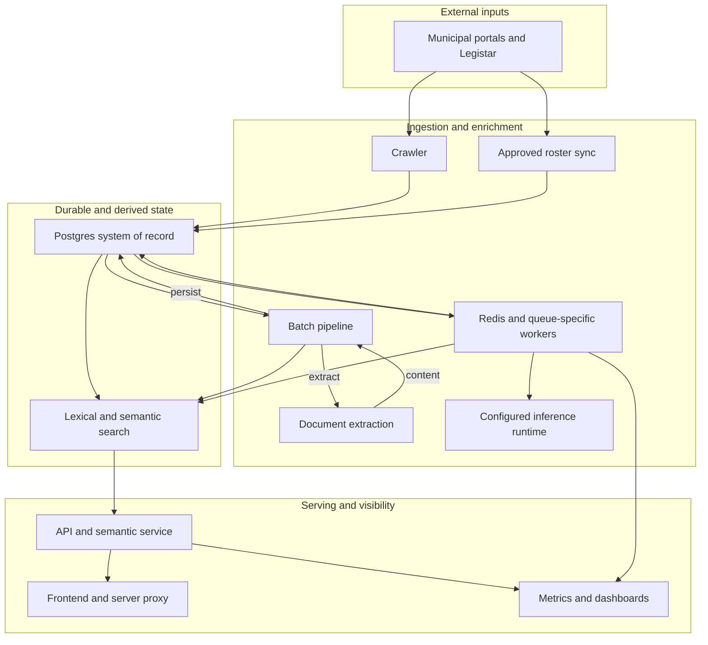

# Town Council Architecture

Last updated: 2026-08-02

## 1. Purpose and Reading Guide

Town Council is a local-first civic data platform. It collects municipal
meeting records, extracts and enriches their content, and makes them available
through lexical and semantic search.

This guide answers four questions:

1. What are the system's main boundaries?
2. How does a meeting record move through the system?
3. Which rules must every change preserve?
4. Where should a contributor start reading or editing?

Use this guide for system intent and ownership. Use the specialist documents
for detail:

- [`docs/PIPELINE.md`](docs/PIPELINE.md) explains pipeline behavior,
  freshness rules, task flows, and failure handling.
- [`docs/OPERATIONS.md`](docs/OPERATIONS.md) contains commands, recovery
  procedures, and operator guidance.
- [`SECURITY.md`](SECURITY.md) defines the threat model and security controls.
- [`docs/DATA_GOVERNANCE.md`](docs/DATA_GOVERNANCE.md) defines civic-data
  authority and person-data policy.
- [`docs/PERFORMANCE.md`](docs/PERFORMANCE.md) owns benchmarks, telemetry
  interpretation, and baseline evidence.
- [`ROADMAP.md`](ROADMAP.md) owns current delivery status and future sequence.

Code and tests remain the source of truth for current behavior, signatures,
schemas, and defaults.

## 2. System at a Glance

Town Council separates ingestion, durable storage, enrichment, search, and
serving. Expensive or write-heavy work runs outside synchronous read paths.

```mermaid
flowchart TB
    accTitle: Town Council system boundaries
    accDescr: Municipal sources enter through crawling or approved roster synchronization. Records are stored in Postgres, enriched by pipeline and worker services, indexed for search, and served through the API and frontend.

    subgraph External["External inputs"]
        Sources["Municipal portals and Legistar"]
    end

    subgraph Processing["Ingestion and enrichment"]
        Crawler["Crawler"]
        Roster["Approved roster sync"]
        Pipeline["Batch pipeline"]
        Tika["Document extraction"]
        Workers["Redis and queue-specific workers"]
        Inference["Configured inference runtime"]
    end

    subgraph Storage["Durable and derived state"]
        Postgres["Postgres system of record"]
        Search["Lexical and semantic search"]
    end

    subgraph Serving["Serving and visibility"]
        API["API and semantic service"]
        Frontend["Frontend and server proxy"]
        Metrics["Metrics and dashboards"]
    end

    Sources --> Crawler --> Postgres
    Sources --> Roster --> Postgres
    Postgres --> Pipeline
    Pipeline -->|"extract"| Tika
    Tika -->|"content"| Pipeline
    Pipeline -->|"persist"| Postgres
    Postgres --> Workers --> Inference
    Workers --> Postgres
    Pipeline --> Search
    Workers --> Search
    Postgres --> Search
    Search --> API --> Frontend
    API --> Metrics
    Workers --> Metrics
```

The diagram is conceptual. Deployment topology and service configuration live
in Compose files and the operations guide.

## 3. Record Lifecycle

### 3.1 Ingest and normalize

1. City-specific Scrapy spiders read municipal portals or Legistar feeds.
2. Crawlers write source evidence to staging tables.
3. Promotion validates staged event rows and creates canonical events in
   Postgres.
4. The downloader fetches staged document URLs. After a file is available, it
   creates or reuses the catalog record and links it to the event through a
   document record.

Staging preserves source evidence. Postgres owns canonical application state.
Crawler success alone does not prove usable city data; onboarding requires
city-attributable staging evidence.

### 3.2 Extract and derive

1. The extraction service sends documents to Tika and persists canonical text
   plus its content hash.
2. Agenda segmentation derives structured agenda items from trusted source
   rows, document text, or a bounded local-model fallback.
3. Summary, topic, entity, vote, lineage, and embedding stages derive new state
   only after their required source state exists.
4. Source hashes identify stale derived values and make regeneration explicit.
5. Indexing publishes current meeting and agenda-item state to search.

Batch processing handles broad backlog work. Celery tasks handle record-scoped
generation and repair. Both paths use the same persistence and freshness
contracts. Exact ordering and fallback behavior live in the
[pipeline guide](docs/PIPELINE.md).

### 3.3 Serve and update

1. Public read paths query Postgres, Meilisearch, or the semantic service.
2. Protected generation requests enter through the frontend server proxy or a
   directly authenticated API call.
3. The API dispatches long-running generation writes to the appropriate Celery
   queue.
4. Workers persist results before best-effort downstream work such as semantic
   embedding dispatch.
5. Clients poll the task-status endpoint until the task reaches a terminal
   state.

This separation keeps search and record reads responsive when extraction or
inference is slow.

### 3.4 Synchronize authoritative rosters

Person and membership records follow a separate authority path. An approved
Legistar OfficeRecords roster, scoped to a municipality and governing body, is
the only supported source. Document mentions, inferred titles, and fuzzy name
matches cannot create or authorize people-facing records.

Cities without a current approved roster fail closed. Full source, validation,
revocation, and recovery semantics live in
[`docs/DATA_GOVERNANCE.md`](docs/DATA_GOVERNANCE.md).

## 4. Service and Trust Boundaries

| Boundary | Responsibility | Primary code owner | Read next |
|---|---|---|---|
| Crawler | Fetch municipal records and preserve staging evidence | `council_crawler/` | [`docs/CONTRIBUTING_CITIES.md`](docs/CONTRIBUTING_CITIES.md) |
| Batch pipeline | Promote, download, extract, enrich, and index corpus state | `pipeline/run_pipeline.py` | [`docs/PIPELINE.md`](docs/PIPELINE.md) |
| API | Serve reads and validate protected writes | `api/main.py`, route modules | [`SECURITY.md`](SECURITY.md) |
| Task execution | Route and run record-scoped generation on queue-specific workers | `pipeline/tasks.py`, queue task owners | [`docs/PIPELINE.md`](docs/PIPELINE.md) |
| Inference | Apply product policy, transport requests, and return typed failures | `pipeline/llm.py`, provider adapters | [`docs/OPERATIONS.md`](docs/OPERATIONS.md) |
| Search | Maintain lexical and semantic indexes; execute semantic retrieval | `pipeline/indexer.py`, `pipeline/semantic_*`, `semantic_service/` | [`docs/PIPELINE.md`](docs/PIPELINE.md) |
| Persistence | Own canonical records, schema, provenance, and derived state | `pipeline/model_*`, `alembic/` | [`docs/DATA_GOVERNANCE.md`](docs/DATA_GOVERNANCE.md) |
| Frontend proxy | Serve the UI and inject protected credentials server-side | `frontend/app/api/`, `frontend/proxy.js` | [`SECURITY.md`](SECURITY.md) |
| Observability | Expose API, worker, task, and provider evidence | `api/metrics.py`, `pipeline/metrics.py` | [`docs/PERFORMANCE.md`](docs/PERFORMANCE.md) |

External HTML, feeds, documents, and provider responses are untrusted. Each is
validated at its ingestion or adapter boundary before it can become canonical
state. Exact parsing and validation rules belong to the owning implementation.

The browser never receives the deployment API key. Frontend server routes add
it when forwarding protected actions. Public read and task-status routes remain
separate from directly authenticated write routes. `SECURITY.md` defines the
complete control set.

## 5. Architecture Invariants

### 5.1 Local-first inference fails explicitly

- Contributor defaults remain local-first.
- Remote acceleration is personal opt-in.
- An unreachable remote inference endpoint is a hard error.
- The system never silently switches from remote to local inference.
- Model selection or cascading is not baseline policy unless the roadmap and
  runbooks explicitly change it.

Product prompting and fallback policy belong to `LocalAI`. Provider adapters
own transport behavior and return typed timeout, unavailable, and response
errors. Calling operations decide whether retry, fail-fast, or deterministic
fallback is allowed.

### 5.2 Reads stay isolated from expensive writes

- Search and record reads do not execute extraction or generation inline.
- Protected generation writes dispatch asynchronous tasks and return task
  identifiers.
- Queue routing keeps default, enrichment, and semantic workloads separate.
- Persisted primary results survive a later best-effort dispatch failure.

### 5.3 Authority and provenance outrank generated content

- Postgres is the system of record.
- Source hashes govern freshness for derived values.
- `manual` and `legistar` are trusted vote sources; LLM extraction never
  overwrites either.
- People and memberships require a currently approved OfficeRecords roster.
- Meeting documents never authorize person or membership records.
- Registry revocation prevents publication even when older roster rows remain
  stored.

Field-level hash rules live in [`docs/PIPELINE.md`](docs/PIPELINE.md). Person
authority and retention rules live in
[`docs/DATA_GOVERNANCE.md`](docs/DATA_GOVERNANCE.md).

### 5.4 Search has distinct lexical and semantic owners

- Meilisearch owns lexical retrieval and facets.
- The semantic service owns semantic retrieval. Pipeline code owns embedding
  persistence and index construction.
- Semantic retrieval can use the configured FAISS/NumPy or pgvector backend.
- The pgvector path degrades missing or stale embeddings to lexical results
  with explicit diagnostics instead of inventing semantic confidence.
- FAISS/NumPy requires local index artifacts and reports the service as
  unavailable when they are missing.
- Record-scoped writes use targeted reindexing; full rebuilds remain repair or
  settings operations.

### 5.5 Schema changes use one migration path

- `pipeline/db_migrate.py` is the supported migration entrypoint.
- Alembic owns the baseline and every post-baseline schema revision.
- Frozen numbered migrations exist only for supported legacy adoption.
- Application startup and data workflows do not create missing schema ad hoc.

### 5.6 Missing telemetry reduces confidence

- API and worker metrics remain separate service surfaces.
- Prefork provider telemetry is exported through Redis-backed aggregates.
- Missing worker or provider metrics reduce confidence; they are not treated as
  equivalent to observed zero values.
- TTFT, throughput, and token metrics remain observational unless performance
  policy promotes them to gates.

Metric names, reports, and baseline interpretation live in
[`docs/PERFORMANCE.md`](docs/PERFORMANCE.md).

## 6. Change Guide and Next Documents

- For crawler behavior or a new city, start with `council_crawler/` and
  [`docs/CONTRIBUTING_CITIES.md`](docs/CONTRIBUTING_CITIES.md).
- For batch stages, extraction, freshness, or task persistence, start with
  [`docs/PIPELINE.md`](docs/PIPELINE.md).
- For API routes, start with the owning route module and generated FastAPI
  OpenAPI documentation. Code and tests define the exact route contract.
- For authentication, proxying, keys, CORS, or exposed services, start with
  [`SECURITY.md`](SECURITY.md).
- For person records or civic-data authority, start with
  [`docs/DATA_GOVERNANCE.md`](docs/DATA_GOVERNANCE.md).
- For schema work, start with `pipeline/db_migrate.py`, `alembic/`, and the
  migration runbook in [`docs/OPERATIONS.md`](docs/OPERATIONS.md).
- For profiling, telemetry, or baseline comparisons, start with
  [`docs/PERFORMANCE.md`](docs/PERFORMANCE.md).
- For tests and approved fake boundaries, start with
  [`docs/TESTING.MD`](docs/TESTING.MD).
- For current milestones or future direction, start with
  [`ROADMAP.md`](ROADMAP.md).
- For durable architecture decisions, use the
  [`docs/ADR.md`](docs/ADR.md) index.

When changing a boundary, update its owning code, tests, and canonical document
together. Do not copy detailed contracts into this guide.

## 7. Document Maintenance

Update `ARCHITECTURE.md` when any of these change:

- service or trust boundaries
- the record lifecycle between major services
- authority, provenance, or freshness invariants
- queue or persistence ownership
- migration ownership
- observability architecture

Do not expand this guide for commands, incident procedures, benchmark results,
profile values, exact route inventories, field inventories, or delivery status.
Update their specialist document instead.

Keep links repository-relative. Update `Last updated` for material changes.
