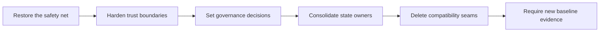

# Postmortem: Town Council remediation program, PRs #108-#220

## Executive Readout

- The program analyzed 59 human-authored remediation PRs from
  [#108](https://github.com/manumissio/town-council/pull/108) through
  [#220](https://github.com/manumissio/town-council/pull/220). Fifty-eight
  merged; one was closed and superseded.
- The work restored mandatory CI gates, hardened trust boundaries, adopted
  durable data and migration policies, and removed the registered
  compatibility seams selected from the architecture review.
- Review identified important gaps before merge. It also exposed a recurring
  problem: custom policy scanners and a mutable prose ledger were asked to
  carry more meaning than their models could support.
- The strongest practice was sequencing. Tests and human decisions landed
  before high-risk deletion work.
- All registered remediation tasks are complete. Follow-up prevention work
  remains open, and City Coverage Expansion still requires a valid
  `baseline_representative_v2` expected-baseline PR.

This was a delivery-system and architecture remediation, not a production
incident. The supplied PR and repository artifacts do not describe an outage,
data-loss event, or security breach.

## Scope And Method

| Measure | Result |
|---|---:|
| PR-number range | 113 PRs, #108-#220 inclusive |
| Remediation PRs analyzed | 59 |
| Merged | 58 |
| Closed and superseded | 1, PR #131 |
| Merge window | July 22-August 2, 2026 |
| Unique paths touched by merged PRs | 399 |
| Changed-file appearances across merged PRs | 697 |
| GitHub additions / deletions | 43,258 / 11,837 |
| Priority-tagged root review threads | 209 |
| Review priority mix | 41 P1, 164 P2, 4 P3, 0 P0 |

### Included

The analyzed population contains human-authored remediation and governance PRs.
The complete list is grouped by lane in the [audit trail](#pr-audit-trail).

### Excluded

- 45 PRs authored by Dependabot.
- Nine dependency-only replacement or coordination PRs:
  [#128](https://github.com/manumissio/town-council/pull/128),
  [#129](https://github.com/manumissio/town-council/pull/129),
  [#152](https://github.com/manumissio/town-council/pull/152),
  [#160](https://github.com/manumissio/town-council/pull/160),
  [#186](https://github.com/manumissio/town-council/pull/186),
  [#205](https://github.com/manumissio/town-council/pull/205),
  [#215](https://github.com/manumissio/town-council/pull/215),
  [#218](https://github.com/manumissio/town-council/pull/218), and
  [#219](https://github.com/manumissio/town-council/pull/219).

### Counting Rules

Review findings count root review threads, not replies. Findings were raised
against pre-merge revisions; they are not evidence that defects reached
production. GitHub line and file totals describe PR snapshots. They do not
measure net surviving code or engineering effort because files were revised
across many PRs.

## Program Arc

| Stage | Main outcome | Representative PRs |
|---|---|---|
| Safety net | Required Python and frontend checks, coverage, and config-owned lint/format scope | [#108](https://github.com/manumissio/town-council/pull/108), [#111](https://github.com/manumissio/town-council/pull/111), [#115](https://github.com/manumissio/town-council/pull/115), [#118](https://github.com/manumissio/town-council/pull/118) |
| Trust boundaries | Restricted service exposure, startup key checks, scoped search credentials, and proxy controls | [#119](https://github.com/manumissio/town-council/pull/119), [#122](https://github.com/manumissio/town-council/pull/122), [#123](https://github.com/manumissio/town-council/pull/123), [#130](https://github.com/manumissio/town-council/pull/130), [#136](https://github.com/manumissio/town-council/pull/136) |
| Durable operations | UTC storage, Alembic, migration reporting, pooled-connection checks, backups, and recovery | [#127](https://github.com/manumissio/town-council/pull/127), [#148](https://github.com/manumissio/town-council/pull/148), [#150](https://github.com/manumissio/town-council/pull/150), [#151](https://github.com/manumissio/town-council/pull/151), [#155](https://github.com/manumissio/town-council/pull/155) |
| Governance | Explicit testing, deployment, migration, and roster-authority decisions | [#133](https://github.com/manumissio/town-council/pull/133), [#134](https://github.com/manumissio/town-council/pull/134), [#143](https://github.com/manumissio/town-council/pull/143), [#196](https://github.com/manumissio/town-council/pull/196), [#209](https://github.com/manumissio/town-council/pull/209) |
| Architecture deletion | Single state owners; removal of cache and registered provider, API, task, and semantic facades; removal of obsolete people projections | [#142](https://github.com/manumissio/town-council/pull/142), [#145](https://github.com/manumissio/town-council/pull/145), [#157](https://github.com/manumissio/town-council/pull/157), [#207](https://github.com/manumissio/town-council/pull/207), [#210](https://github.com/manumissio/town-council/pull/210), [#211](https://github.com/manumissio/town-council/pull/211), [#212](https://github.com/manumissio/town-council/pull/212), [#213](https://github.com/manumissio/town-council/pull/213), [#216](https://github.com/manumissio/town-council/pull/216), [#217](https://github.com/manumissio/town-council/pull/217) |
| Frontend lifecycle | Behavior-tested cancellation and agenda settlement through one polling owner | [#220](https://github.com/manumissio/town-council/pull/220) |

## Architecture Review Disposition

The July 19 architecture review proposed narrow, sequenced changes rather than
a repository-wide rewrite. The program followed that constraint.

| Review area | Landed response | Result |
|---|---|---|
| Metrics state | T-DA-1, [#142](https://github.com/manumissio/town-council/pull/142) | Removed bidirectional Redis metric globals. |
| Frontend proxy | T-SEC-4/5, [#130](https://github.com/manumissio/town-council/pull/130) and [#136](https://github.com/manumissio/town-council/pull/136) | Added origin and trusted-client policy at the proxy boundary. |
| Application startup | T-DC-1, [#157](https://github.com/manumissio/town-council/pull/157) | Gave startup state one owner and removed reverse imports. |
| Summary hydration | T-DB-1A/1/1B, [#144](https://github.com/manumissio/town-council/pull/144)-[#147](https://github.com/manumissio/town-council/pull/147) | Removed facade and callable-injection seams. |
| Provider contract | T-DE-1/2, [#158](https://github.com/manumissio/town-council/pull/158) and [#210](https://github.com/manumissio/town-council/pull/210) | Kept real adapters; removed reverse and compatibility facade dependencies. |
| City and health maintenance | T-DD-1A/1B, [#153](https://github.com/manumissio/town-council/pull/153) and [#156](https://github.com/manumissio/town-council/pull/156) | Consolidated only the proved duplicate operations. |
| Crawler templates | T-CRAWL-2, [#126](https://github.com/manumissio/town-council/pull/126) | Reused one archive-table implementation with fixture coverage. |
| Guardrail policy | T-CI and T-GOV-3, [#108](https://github.com/manumissio/town-council/pull/108), [#154](https://github.com/manumissio/town-council/pull/154), [#206](https://github.com/manumissio/town-council/pull/206) | Replaced file inventories with config-owned scope and bounded structural rules. |
| Facade strata | T-DC-2A/2B, T-TASK-1, T-SEM-1, T-IDX-1, T-FE-1A | Deleted registered facades, removed obsolete people projections, and consolidated the frontend polling lifecycle after their gates were ready. |

## What Worked

### Put gates before deletion

The program restored CI and accepted the testing-boundary decision before
removing facade patch points. Later deletion PRs could use direct owners and
observable tests instead of adding compatibility aliases.

### Make policy decisions explicit

G1-G5 were approved and recorded before dependent implementation. This kept
agents from silently choosing deployment, visitor-access, testing, person-data,
or migration policy.

### Split independent concerns

[PR #131](https://github.com/manumissio/town-council/pull/131) mixed a security
closure with separate policy decisions. It was closed without merge. PRs
[#132](https://github.com/manumissio/town-council/pull/132),
[#133](https://github.com/manumissio/town-council/pull/133), and
[#134](https://github.com/manumissio/town-council/pull/134) carried the concerns
separately.

### Treat review as verification

Review found lifecycle, migration, normalization, CI-environment, and policy
gaps that existing tests did not model. PR descriptions record focused fixes
and regression coverage. The aggregate thread export does not independently
verify every final thread resolution.

### Prefer deletion after ownership is clear

The final architecture wave removed generic cache code, facade bags, reverse
lookups, and obsolete projections. It did not preserve old patch targets with
new wrappers.

## Where Work Expanded

### Review concentration

| Signal | Finding |
|---|---|
| Four PRs | [#134](https://github.com/manumissio/town-council/pull/134), [#143](https://github.com/manumissio/town-council/pull/143), [#196](https://github.com/manumissio/town-council/pull/196), and [#206](https://github.com/manumissio/town-council/pull/206) generated 127 of 209 root threads, or 61%. |
| Two files | `tests/test_repository_guardrails.py` and `docs/plans/TOWN_COUNCIL_REMEDIATION_PLAN.md` generated 140 root threads, or 67%. |
| Policy classifiers | PRs #134 and #196 generated 94 roots, mostly iterative variants around custom prose interpretation. |
| Structural analyzer | PR #206 generated 17 roots while a custom analyzer tried to model SQLAlchemy and Python binding behavior. |
| Migration/recovery | PRs #143 and #155 generated 25 roots across fresh, legacy, delayed-adopter, rollback, and derived-state scenarios. |

This was not a uniform quality problem. Twenty-three analyzed PRs had no root
review finding. The concentration points to specific process and design
problems.

### The ledger became a hot path

The remediation plan was touched by all 59 analyzed PRs. It accumulated 124
changelog entries and reached version 4.04. That audit trail helped sequencing,
but it also made status, ownership, and policy synchronization a recurring
source of review findings.

### Review stayed example-led for too long

In PRs #108, #134, #196, and #206, a fix often handled the latest reported
spelling, syntax form, or binding case. The next review then found a neighboring
case. After the second same-class finding, the program should have stopped and
restated the supported contract instead of adding another branch.

## Root Cause Analysis

**Root cause category**: Incomplete behavioral and operational models

| Level | What the evidence showed | Why it mattered |
|---|---|---|
| Direct | Initial ownership often followed the expected diff, not every entrypoint, consumer, state owner, rollback path, test, and canonical document. | Review repeatedly found valid files outside the first ownership set. |
| Direct | Custom checks tried to infer natural-language policy, Python binding, or control flow from partial models. | Each wider claim created more untested equivalent forms. |
| Direct | Free-form prose carried both rationale and machine-enforced task state. | Ordinary wording and status edits became policy execution paths. |
| Contributing | Some tests counted source tokens, inspected identifiers, mutated private state, or asserted calls. | They constrained implementation while failing to prove public behavior. |
| Contributing | Migration, recovery, and cancellation plans began with the successful path. | Cold starts, version skew, partial failure, and post-await cancellation appeared late. |
| Contributing | Local representations and remembered dependency behavior stood in for clean-runner or transport behavior. | CI, HTTP parsing, crawler lifecycle, and roster normalization differed at real boundaries. |

## Lessons To Reuse

1. **After the second same-class finding, stop patching.** Rebuild the case
   matrix, name unsupported behavior, and decide whether the mechanism should
   be deleted.
2. **Draw ownership from the contract graph.** Trace entrypoints, producers,
   consumers, persisted and derived state, rollback, docs, tests, and CI before
   fixing the file list.
3. **Use maintained tools for language semantics.** Prefer Ruff, parsers,
   typed contracts, and real protocol clients. Keep custom checks narrow and
   syntactic.
4. **Test outcomes, not source arrangements.** Assert rendered UI, persisted
   state, dispatch at approved boundaries, schema, exit status, and lifecycle
   behavior.
5. **Write rollback as a state machine.** Include stopped, partial, stale,
   delayed-adopter, and old-release states when they are reachable.
6. **Keep policy meaning separate from task status.** ADRs explain durable
   decisions. A small operational tracker records state and evidence.
7. **Delete compatibility code when its gate lands.** Do not replace one test
   seam with another wrapper.
8. **Use review findings as design feedback.** A cluster means the model is
   wrong or too broad, not that the next edge case needs more code.

## Prevention And Follow-up

| Trigger | Required response | Automated control | Accountable role | Complete when |
|---|---|---|---|---|
| Before the next broad remediation program | Freeze this remediation plan as historical evidence. Use a new focused plan instead of extending its 124-entry changelog. | Docs-link and status checks only; do not build another prose-state parser. | Repository operator | The completed plan is marked historical and no new task is registered in it. |
| Before City Coverage Expansion | Produce the valid `baseline_representative_v2` expected baseline. | Generate the baseline report and reproducibility evidence with the existing profiler. | Repository operator | The baseline-valid evidence PR is reviewed and merged. |
| A second same-class P1/P2 appears | Stop local patches. Restate the case matrix, supported boundary, and simpler alternatives. | Group root threads by file and finding family; do not automate the decision. | Current PR owner | The revised plan explains whether to delete, delegate, or narrow the mechanism before another patch. |
| A custom prose, binding, or control-flow checker is touched | Prefer a maintained tool or structured field. Keep custom enforcement syntactic and bounded. | Use exact-set or differential fixtures against the pinned tool. | Guardrail maintainer | The check names supported and unsupported cases, or is deleted. |
| A high-risk cross-boundary change begins | Trace entrypoints, consumers, persisted and derived state, rollback, canonical docs, tests, and CI before fixing ownership. | Validate the declared owned files and applicable verification rows. | Current task owner | The Full plan covers every reachable contract path without speculative files. |
| Runtime behavior changes | Test the public outcome or approved fake boundary, not source tokens, private state, or call counts. | Keep behavior tests for cancellation, persistence, routing, schema, and rollback. | Current task owner | Tests fail on the behavioral regression while permitting internal refactoring. |
| A compatibility seam is encountered during normal domain work | Apply the deletion test; do not start a broad cleanup campaign. | Use dependency reports as evidence, not as automatic approval. | Architecture steward | The change proves duplication or reverse dependency and removes more seam machinery than it adds. |

### AI Coding Context

Load this postmortem with [`AGENTS.md`](../../AGENTS.md),
[`docs/TESTING.MD`](../TESTING.MD), and the relevant architecture or governance
document before guardrail, migration, recovery, facade, person-data, or task
lifecycle work. Start from current code and tests. Verify upstream behavior.
Prefer deletion and direct ownership.

## Current Boundaries And Remaining Gate

- Local-first runtime defaults remain unchanged.
- Remote inference remains explicit opt-in and fail-fast.
- Soak gate semantics remain unchanged. Baseline comparability intentionally
  moved from historical, non-comparable v1 evidence to v2, whose expected
  baseline is still pending.
- Person entities remain roster-gated and fail closed without approved roster
  evidence.
- Compatibility cleanup outside registered domains remains out of scope.
- City Coverage Expansion remains blocked until the valid v2 expected-baseline
  PR merges.

## PR Audit Trail

CI and delivery guardrails: 11 PRs

[#108](https://github.com/manumissio/town-council/pull/108),
[#110](https://github.com/manumissio/town-council/pull/110),
[#111](https://github.com/manumissio/town-council/pull/111),
[#112](https://github.com/manumissio/town-council/pull/112),
[#113](https://github.com/manumissio/town-council/pull/113),
[#115](https://github.com/manumissio/town-council/pull/115),
[#116](https://github.com/manumissio/town-council/pull/116),
[#117](https://github.com/manumissio/town-council/pull/117),
[#118](https://github.com/manumissio/town-council/pull/118),
[#120](https://github.com/manumissio/town-council/pull/120), and
[#121](https://github.com/manumissio/town-council/pull/121).

Security and trust boundaries: 13 PRs

[#119](https://github.com/manumissio/town-council/pull/119),
[#122](https://github.com/manumissio/town-council/pull/122),
[#123](https://github.com/manumissio/town-council/pull/123),
[#125](https://github.com/manumissio/town-council/pull/125),
[#130](https://github.com/manumissio/town-council/pull/130),
[#131](https://github.com/manumissio/town-council/pull/131) (closed),
[#132](https://github.com/manumissio/town-council/pull/132),
[#133](https://github.com/manumissio/town-council/pull/133),
[#135](https://github.com/manumissio/town-council/pull/135),
[#136](https://github.com/manumissio/town-council/pull/136),
[#137](https://github.com/manumissio/town-council/pull/137),
[#138](https://github.com/manumissio/town-council/pull/138), and
[#139](https://github.com/manumissio/town-council/pull/139).

Crawler and time correctness: 4 PRs

[#124](https://github.com/manumissio/town-council/pull/124),
[#126](https://github.com/manumissio/town-council/pull/126),
[#127](https://github.com/manumissio/town-council/pull/127), and
[#148](https://github.com/manumissio/town-council/pull/148).

Data, database, migrations, and operations: 14 PRs

[#142](https://github.com/manumissio/town-council/pull/142),
[#143](https://github.com/manumissio/town-council/pull/143),
[#144](https://github.com/manumissio/town-council/pull/144),
[#145](https://github.com/manumissio/town-council/pull/145),
[#146](https://github.com/manumissio/town-council/pull/146),
[#147](https://github.com/manumissio/town-council/pull/147),
[#150](https://github.com/manumissio/town-council/pull/150),
[#151](https://github.com/manumissio/town-council/pull/151),
[#153](https://github.com/manumissio/town-council/pull/153),
[#155](https://github.com/manumissio/town-council/pull/155),
[#156](https://github.com/manumissio/town-council/pull/156),
[#157](https://github.com/manumissio/town-council/pull/157),
[#158](https://github.com/manumissio/town-council/pull/158), and
[#207](https://github.com/manumissio/town-council/pull/207).

Governance and structural policy: 10 PRs

[#134](https://github.com/manumissio/town-council/pull/134),
[#140](https://github.com/manumissio/town-council/pull/140),
[#141](https://github.com/manumissio/town-council/pull/141),
[#154](https://github.com/manumissio/town-council/pull/154),
[#159](https://github.com/manumissio/town-council/pull/159),
[#196](https://github.com/manumissio/town-council/pull/196),
[#206](https://github.com/manumissio/town-council/pull/206),
[#208](https://github.com/manumissio/town-council/pull/208),
[#209](https://github.com/manumissio/town-council/pull/209), and
[#214](https://github.com/manumissio/town-council/pull/214).

Final architecture deletion wave: 7 PRs

[#210](https://github.com/manumissio/town-council/pull/210),
[#211](https://github.com/manumissio/town-council/pull/211),
[#212](https://github.com/manumissio/town-council/pull/212),
[#213](https://github.com/manumissio/town-council/pull/213),
[#216](https://github.com/manumissio/town-council/pull/216),
[#217](https://github.com/manumissio/town-council/pull/217), and
[#220](https://github.com/manumissio/town-council/pull/220).

## Evidence

- [Town Council remediation plan](../plans/TOWN_COUNCIL_REMEDIATION_PLAN.md)
- [Architecture review](../reviews/architecture-review-2026-07-19.html)
- [PR #108 postmortem](2026-07-21-pr-108-python-guardrail-baseline.md)
- [Roadmap](../../ROADMAP.md)
- [Performance policy](../PERFORMANCE.md)

The GitHub PR pages are the detailed records for discussion, review, checks,
and merge state. Aggregate statistics in this postmortem were generated from
GitHub PR metadata and root review-thread exports on 2026-08-02.
