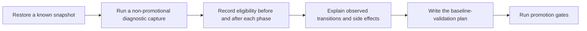

# Postmortem: Why PR #224 was closed without merge

## Executive Readout

- [PR #224](https://github.com/manumissio/town-council/pull/224) tried to
  combine post-remediation documentation checks, baseline capture and
  validation, and architecture investigations in one implementation-ready
  plan.
- The plan predicted how many records each pipeline phase would process before
  observing a restored-state run. That prediction was invalid because earlier
  phases can make additional records eligible for later phases.
- Review found 21 priority issues across 10 revisions: 7 P1 and 14 P2. The
  revisions corrected individual cases, but the shared premise remained wrong.
- All CI checks passed. They showed only that existing automated gates remained
  green; they did not inspect the plan's syntax, links, or semantic claims.
- The PR was correctly closed without merge. No production behavior changed,
  and no outage, data loss, or security incident occurred.

This was a planning-system incident. The failure was not that the plan lacked
detail. The failure was that it used detail to substitute for missing evidence.

## Impact

| Area | Impact |
|---|---|
| Delivery | Nearly one day and 10 commits were spent revising a plan that could not be made reliable from static evidence alone. |
| Review | Review became a serial search for the next counterexample instead of an early challenge to the plan's premise. |
| Confidence | The PR reported convergence from five independent reviews, but later reviews still found P1 defects. |
| Repository | The PR changed one proposed document and was closed unmerged. Default-branch code and policy were unaffected. |
| Production | No runtime change, outage, data loss, person-data exposure, or security breach occurred. |

## What the PR Tried to Do

The proposed follow-up plan carried three different kinds of work:

1. Add bounded checks for documentation file maps.
2. Define and promote a new representative performance baseline.
3. Investigate remaining architecture concerns.

Each lane had a different evidence source and completion rule. Combining them
created one large plan in which static documentation rules, empirical pipeline
behavior, and open-ended investigation appeared equally predictable.

The baseline lane was the critical failure. It treated manifest quotas as an
execution contract. A quota can say which records enter a run. It cannot say
how many records later phases will process after the run changes their state.

## Timeline

| Time (UTC) | Event | Signal |
|---|---|---|
| 00:02 | PR opened with a 385-line plan. | The plan was broad before runtime evidence existed. |
| 00:07 | First review raised three P1s and one P2. | Canonical policy, migration, tracker, and file-map boundaries were incomplete. |
| 00:19-16:53 | Seven revisions addressed policy, wildcard, ownership, verification, and parser cases. | Findings remained local while the plan grew to 458 lines and 3,542 words. |
| 21:23 | The plan was rewritten as evidence-first after five independent reviews were reported. | Review had not yet challenged all downstream phase effects. |
| 21:28 | A P1 showed segmentation could expand summary work. | The execution-count model was incomplete. |
| 21:49 | Another revision corrected evidence contracts. | The same underlying model was retained. |
| 21:55 | A final P1 showed extraction could expand segmentation, summary, and entity work. | Static counts could not describe the run. |
| 22:11 | The PR was closed without merge. | Work was reset to smaller evidence-first tasks. |

Across the PR, commit-level churn reached 1,242 inserted and 748 deleted lines
for a final 494-line file. Churn is not itself a defect, but here it showed that
review was repeatedly changing the model rather than polishing a settled one.

## Root Cause Analysis

**Root cause category**: Evidence was collected after the plan tried to encode
its conclusions.

### Direct cause: phase effects were treated as fixed counts

The pipeline runs phases in order. Earlier phases can change catalog state:

- Extraction can produce content that makes a catalog eligible for
  segmentation, summary hydration, or entity enrichment.
- Segmentation can invalidate or clear summary state, creating summary work.
- Organization processing can include events related to the selected catalogs,
  not only records in a directly named quota.

The plan used pre-run selections as if they described post-phase execution.
They do not. The only reliable way to learn those counts is to observe phase
transitions on the restored snapshot.

### Contributing cause: unrelated lanes shared one plan

The documentation checker had a bounded, syntactic contract. Baseline
validation required runtime evidence. Architecture investigations required
scoping discoveries. A single master plan forced all three into one apparent
execution sequence and made unresolved questions look like implementation
details.

### Contributing cause: review optimized the current frame

Most findings were valid, but they corrected the latest omission inside the
plan. After the second related finding, review should have asked whether the
plan could know the answer at all.

The clearest warning was reported review convergence followed almost
immediately by a new P1. Even independent reviewers can miss a defect when
they all accept the same premise instead of challenging the question.

### Contributing cause: “implementation-ready” was declared too early

The first production run was expected to reveal phase eligibility and terminal
outcomes. Those values were also used by the plan as predetermined acceptance
criteria. The unknown output should have been the purpose of an evidence task,
not a contract embedded in an implementation plan.

## Why CI Passed

The final head passed Python Guardrails, frontend tests, and all CodeQL jobs.
Those checks established only that the repository's existing automated gates
remained green on a branch whose diff contained one new Markdown file. None of
the checks inspected that file's syntax, links, or semantic claims.

CI could prove that:

- existing test and static-analysis contracts still passed;
- no failure was detected in the executable paths those checks exercised.

CI could not prove that:

- the proposed document was syntactically or semantically correct;
- links in the proposed document resolved;
- a restored dataset would create the predicted downstream work;
- phase counts would remain fixed after extraction or segmentation;
- the proposed baseline was comparable or promotion-ready;
- the combined plan asked the right question.

A green check is evidence only for the contract that check executes.

## What Worked

- Priority review findings were surfaced before merge.
- The branch did not weaken tests, runtime policy, or baseline rules to obtain a
  green result.
- The final unresolved P1 was treated as evidence of a structural problem, not
  patched with another guessed count.
- Closing the PR prevented speculative policy from becoming a canonical plan.
- The closure comment recorded the correct recovery direction: diagnostic
  capture first, baseline validation second, architecture work separately.

## What We Should Have Done

The first task should produce evidence, not a baseline decision. Its output
should include:

- snapshot identity and runtime profile;
- selected catalogs and their starting state;
- profile-preparation mutations recorded separately from measured work;
- eligibility before and after every mutating phase reached by the profiler's
  executable command graph;
- attempted, completed, skipped, failed, and newly eligible records;
- queue and service health relevant to interpretation;
- summary invalidations and other downstream side effects;
- reasons the run is diagnostic and non-comparable.

Only after that trace exists should a second plan define
`baseline_representative_v2`, expected values, tolerances, and promotion rules.

Architecture investigations should be separate, prioritized tasks. Their first
deliverable is evidence about one boundary, not another combined master plan.

## Lessons To Reuse

1. **Evidence precedes contracts for state-dependent systems.** Do not specify
   expected phase counts before observing how phases change eligibility.
2. **A manifest describes inputs, not all resulting work.** Separate direct
   selection from work created during execution.
3. **After two related review findings, stop patching.** Restate the invariant
   and decide whether the plan's premise is knowable.
4. **Review independence is not premise independence.** Assign at least one
   reviewer to challenge the question and required evidence, not improve the
   proposed answer.
5. **Green CI has a bounded meaning.** Report exactly what each check proves and
   what remains empirical.
6. **Do not combine evidence collection, promotion policy, and open
   investigation.** They have different outputs and stop conditions.
7. **More detail cannot repair missing evidence.** A longer plan can make an
   unsupported claim harder to notice.

## Prevention And Next Steps

| Action | Owner | Completion evidence |
|---|---|---|
| Create a non-promotional diagnostic v2 capture task with no fixed downstream execution counts. | Pipeline maintainer | Captured phase-transition artifact from an identified restored snapshot. |
| Record eligibility before and after each mutating phase. | Pipeline maintainer | Artifact derives its inventory from the executable profile command graph and covers preparation, extraction, segmentation, summaries, entities, tables, organizations/events, topics, catalog-to-event expansion, and asynchronous indexing or embedding side effects. |
| Write the baseline-validation plan from the captured trace. | Performance owner | Plan cites observed values and states why each expected value is stable. |
| Keep architecture investigations in separate, bounded tasks. | Architecture owner | Each task names one question, evidence source, and stop condition. |
| Add a premise-challenge question to planning review: “What must be observed before this can be specified?” | Review lead | Review record answers the question before implementation-ready status. |
| Stop and re-plan after a second finding from the same root-cause family. | Author and reviewer | Review record identifies the shared invariant and revised scope. |

No new prose parser or plan validator is proposed. The prevention mechanism is
better ordering, smaller tasks, direct runtime evidence, and an explicit stop
when repeated findings challenge the same premise.

## AI Coding Context

Load this postmortem before planning baseline capture, pipeline profiling, or a
multi-lane follow-up program.

AI agents should:

- distinguish values known from code from values knowable only from a run;
- map every mutating phase that can expand later eligibility;
- state what the first production or diagnostic run is expected to reveal;
- challenge the task premise after repeated related findings;
- avoid presenting reviewer count as proof of correctness;
- keep diagnostic capture explicitly non-promotional.

## Evidence

- [PR #224](https://github.com/manumissio/town-council/pull/224)
- [Final unresolved P1: extraction-expanded downstream work](https://github.com/manumissio/town-council/pull/224#discussion_r3707952300)
- [Closure record](https://github.com/manumissio/town-council/pull/224#issuecomment-5172294374)
- `pipeline/run_pipeline.py`: extraction precedes generation backfills.
- `pipeline/agenda_worker.py`: hydrated agendas can become segmentation
  candidates.
- `pipeline/run_pipeline_selectors.py`: hydrated content can become entity
  enrichment work.

The postmortem reflects the final unmerged head and GitHub review state at
closure. It does not treat unmerged plan text as repository policy.
