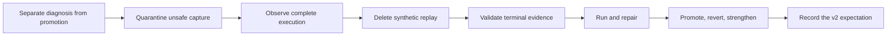

# Postmortem: Build trustworthy baseline-v2 evidence

## Executive Readout

- The goal merged a checked-in `baseline_representative_v2` expectation and
  executable guards for workload completion, runtime identity, and comparison.
- It required 21 merged pull requests between
  [#230](https://github.com/manumissio/town-council/pull/230) and
  [#262](https://github.com/manumissio/town-council/pull/262). Those PRs touched
  101 unique paths in the final first-parent diff.
- The work did not expand because one bug was unusually hard. Known evidence
  requirements were implemented serially, an attempted replay design was
  later deleted, real captures exposed runtime defects, fresh cohorts were
  consumed, and the first promotion was reverted.
- The central process failure was acceptance ordering. Promotion was attempted
  before one reviewed contract covered nonempty starting work, phase
  transitions, asynchronous task outcomes, runtime identity, and an independent
  reproduction attempt.
- The strongest recoveries were fail-closed quarantine, deletion of unsafe
  replay machinery, real end-to-end execution, and an immediate revert when the
  first expected baseline did not reproduce.

This was an evidence-integrity and delivery-system incident. The reviewed
records do not describe a production outage, data loss, or security event.

## What Was Proven

The default branch now contains:

- a baseline expectation tied to the tracked v2 manifest digest;
- terminal validation that starts runs as invalid and promotes only after the
  required evidence passes;
- rejection of empty or malformed initial workload evidence;
- phase eligibility, Celery dispatch, task-attempt, provider, search, and
  terminal-result checks;
- comparison of every runtime field declared by the expectation; and
- current policy text that keeps diagnostic runs non-comparable and synthetic
  replay retired.

The repository reports that two captures began with the same 30 eligible
catalogs, produced matching stable counters, and stayed within the existing
timing tolerances. The raw capture directories are not checked into the
repository. This postmortem can therefore verify the merged contract and the
recorded result, but it cannot independently replay or audit those raw runs.

This result closes the expected-baseline prerequisite in
[`ROADMAP.md`](../../ROADMAP.md). It does not, by itself, prove all City
Expansion Readiness criteria, production stability, model quality, or broad
workload representativeness.

## Scope And Counting

| Measure | Result |
|---|---:|
| Merged PRs analyzed | 21 |
| Merge window | August 8-13, 2026 |
| Unique paths in the first-parent program diff | 101 |
| Final first-parent diff | 6,821 additions, 2,239 deletions |
| First expected-baseline promotion | PR #250 |
| Revert after failed reproduction | PR #251 |
| Final promotion | PR #262 |

The PR count is not a quality score. The line totals are the net endpoint diff,
not engineering effort, cumulative churn, or surviving complexity. PR #250
and its revert both count because the promote-then-revert sequence is part of
the incident.

## The 21 PRs, Classified

| Work class | PRs | What the class explains |
|---|---|---|
| Evidence-contract construction | [#230](https://github.com/manumissio/town-council/pull/230), [#235](https://github.com/manumissio/town-council/pull/235), [#237](https://github.com/manumissio/town-council/pull/237), [#238](https://github.com/manumissio/town-council/pull/238), [#239](https://github.com/manumissio/town-council/pull/239), [#240](https://github.com/manumissio/town-council/pull/240), [#241](https://github.com/manumissio/town-council/pull/241), [#246](https://github.com/manumissio/town-council/pull/246), [#252](https://github.com/manumissio/town-council/pull/252) | Diagnostic isolation, phase transitions, dispatch, task execution, terminal validity, and nonempty-work checks were built over nine PRs. |
| Runtime and environment defects | [#231](https://github.com/manumissio/town-council/pull/231), [#242](https://github.com/manumissio/town-council/pull/242), [#244](https://github.com/manumissio/town-council/pull/244), [#245](https://github.com/manumissio/town-council/pull/245), [#248](https://github.com/manumissio/town-council/pull/248) | Real execution exposed crawler, worker, staging, selector, persistence, transaction, and empty-phase defects. |
| Discarded replay implementation | [#232](https://github.com/manumissio/town-council/pull/232), [#243](https://github.com/manumissio/town-council/pull/243) | Replay packages and selected-record reset logic were added, then deleted when their trust boundary proved too weak. |
| Cohort and promotion churn | [#247](https://github.com/manumissio/town-council/pull/247), [#249](https://github.com/manumissio/town-council/pull/249), [#250](https://github.com/manumissio/town-council/pull/250), [#251](https://github.com/manumissio/town-council/pull/251), [#262](https://github.com/manumissio/town-council/pull/262) | Fresh records were selected, replaced after mutation, promoted too early, reverted, and finally promoted under a stronger contract. |

This classification matters. Saying only “21 PRs” hides the difference between
necessary contract work, product defects, discarded machinery, and avoidable
promotion rework.

## Program Arc



### 1. Diagnosis became explicitly non-promotional

[PR #230](https://github.com/manumissio/town-council/pull/230) added a
diagnostic path whose result remains `baseline_valid=false`.
[PR #235](https://github.com/manumissio/town-council/pull/235) then blocked
promotion-grade capture while the evidence contract was incomplete.

This was the right first containment move. It let the profiler expose gaps
without allowing exploratory output to become a promotion artifact.

### 2. The profiler learned to prove work, not only time it

[PRs #238-#241](https://github.com/manumissio/town-council/pull/238)
added the missing evidence families:

- before-and-after eligibility for synchronous phases;
- subject-specific organization obligations;
- producer-side Celery dispatch attempts; and
- worker attempts with retry and redelivery identity.

These categories were not wholly new discoveries. The
[#224 planning postmortem](2026-08-03-pr-224-speculative-follow-up-plan.md)
had already called for phase transitions, task outcomes, and diagnostic capture
before promotion. The failure was converting known requirements into several
local PRs instead of freezing one end-to-end acceptance matrix first.

### 3. Synthetic replay failed the deletion test

[PR #232](https://github.com/manumissio/town-council/pull/232) tried to make
selected records replayable with package metadata, source hashes, and targeted
database resets. The implementation was careful inside its chosen boundary.
The boundary was still too small: related database state, services,
asynchronous work, and intervening writes remained mutable.

[PR #243](https://github.com/manumissio/town-council/pull/243) deleted the
replay packages, sidecars, builders, selected-record reset path, and related
tests. This was not lost progress. It was the correct response to an unsound
reproducibility model. The durable rule now lives in
[`docs/ADR.md`](../ADR.md): use observed execution from a restored full snapshot
or equivalent fresh pending state, not reconstructed selected rows.

### 4. Real runs found real defects

Fresh-work execution exposed defects below the profiler:

- crawler startup could finish without scheduling the intended requests;
- the semantic worker lacked a metrics dependency needed at startup;
- staged promotion could include unrelated work;
- completed agenda segmentation could remain eligible;
- oversized titles and failed transactions could break persistence; and
- successful zero-work phases could omit required spans.

PRs #231, #242, #244, #245, and #248 fixed those defects. They were not the
systemic cause of the goal's expansion. They showed that unit and contract
tests had stopped below the full capture boundary.

### 5. The first promotion was premature

[PR #250](https://github.com/manumissio/town-council/pull/250) promoted an
expected baseline after one successful capture and a self-comparison. An
immediate rerun selected no work. The self-comparison had proved that the
comparator could agree with its own input; it had not proved that the workload
could be recreated.

[PR #251](https://github.com/manumissio/town-council/pull/251) reverted the
expectation. [PR #252](https://github.com/manumissio/town-council/pull/252)
then made empty, malformed, duplicated, and mismatched initial eligibility fail
closed. [PR #262](https://github.com/manumissio/town-council/pull/262) recorded
the final expectation after the repository reported two matching captures and
added complete runtime-profile comparison.

The revert was a success of the safety culture. The need for it was an
acceptance-ordering failure.

## Root Cause Analysis

**Root cause category**: Known evidence obligations were not frozen as one
promotion contract before implementation and capture.

| Level | Cause | Consequence |
|---|---|---|
| Direct | Baseline status originally represented mode selection rather than terminal evidence. | Operator intent could be confused with completed, comparable work. |
| Direct | The selected manifest identified records but not the mutable state that made them eligible. | A successful run consumed the workload; rerunning the same IDs produced a no-op. |
| Direct | Promotion happened before nonempty-work and second-capture requirements were enforced. | PR #250 merged and then required a corrective revert. |
| Contributing | Evidence categories already named after PR #224 were implemented one boundary at a time. | Review found the next missing proof locally instead of checking one complete matrix. |
| Contributing | Replay machinery was built before its trust boundary was proved sufficient. | PR #232 added a path that PR #243 later removed. |
| Contributing | Promotion work and runtime readiness work were interleaved. | Scarce fresh cohorts were consumed while crawler, worker, selector, and persistence defects were still surfacing. |
| Contributing | Passing unit suites and self-comparison were given more meaning than their contracts supported. | Green checks did not prove full-path readiness or experimental reproduction. |

## What Worked

### Fail closed, then restore capability

The program blocked promotion while evidence was incomplete, restored it only
after terminal validation existed, and rejected malformed or empty evidence.
No gate was weakened to keep the work moving.

### Delete the wrong model

The synthetic replay implementation did not survive as a legacy path. The
first expected baseline also did not survive after its procedure failed. Both
deletions kept unsupported claims out of the active operating model.

### Use real execution as evidence

Fresh runs exposed product defects that static review could not prove away.
Those defects received focused fixes and observable regression tests before the
final promotion.

### Keep diagnostic and promotion meanings separate

The final system distinguishes an exploratory capture from a comparable
baseline. This prevents a useful diagnostic from becoming evidence for a
decision it was not designed to support.

## Lessons To Reuse

1. **Validity is an output, not an option.** Start invalid. Promote through one
   authority only after terminal evidence passes.
2. **A manifest identifies requested records, not reusable state.** If
   freshness or related records affect selection, the starting snapshot is
   part of the workload contract.
3. **Freeze the evidence matrix before implementation.** Name every producer,
   artifact, validator, failure reason, and promotion consumer in one place.
4. **A successful no-op is not performance evidence.** Require well-formed,
   nonempty initial work and paired after-state evidence.
5. **Self-comparison is a parser test, not a reproduction test.** Promotion
   needs a second capture from the same restored state or equivalent fresh
   state.
6. **Measure transitions as well as durations.** Synchronous work needs
   before-and-after eligibility; asynchronous work needs dispatch, start,
   retry or redelivery, and terminal outcome.
7. **Run a disposable full-path rehearsal before consuming promotion data.**
   Find crawler, image, worker, queue, database, and search defects while the
   result is still explicitly diagnostic.
8. **Delete an unsound mechanism instead of adding more guards around it.** A
   smaller supported path is easier to reason about and operate.
9. **After two related findings, stop patching.** Restate the invariant and
   review the complete case matrix before another local fix.
10. **State exactly what green evidence proves.** Tests and CI verify their
    encoded contracts; they do not automatically prove empirical
    representativeness or reproduction.

## Closed-Loop Audit Of The Prior Postmortem

The PR #224 postmortem prescribed an evidence-first recovery. Most of those
actions are now complete.

| Earlier action | Landed evidence | Status |
|---|---|---|
| Add a non-promotional diagnostic path. | PRs #230 and #237 | Complete |
| Record eligibility around mutating phases. | PRs #238 and #241 | Complete |
| Record dispatch and execution outcomes. | PRs #239 and #240 | Complete |
| Write promotion rules from observed evidence. | PRs #235 and #246 | Complete |
| Reject incomplete or empty work. | PRs #246 and #252 | Complete |
| Keep architecture investigation separate. | Baseline PR scope remained focused on profiling and runtime blockers. | Complete |
| Promote only after reproduced evidence. | PR #262 records the final result. | Recorded complete; independent audit unavailable because the raw captures are not retained here. |

This audit matters because prevention actions should eventually be closed,
revised, or rejected. They should not remain permanent open-ended advice.

## Actionable Next Steps

The future PR or issue named under **Tracking and control** is the durable
record for each action.

| Trigger | Accountable role | Action | Tracking and control | Durable completion evidence |
|---|---|---|---|---|
| Before implementation or capture for the next expected baseline | Baseline PR author | Freeze one end-to-end evidence matrix in the plan or PR body. Include starting-state identity, manifest identity, nonempty eligibility, phase transitions, async outcomes, runtime identity, two captures, and the final promotion decision. | Next expected-baseline PR; reviewers block implementation until the matrix is approved. | The approved PR description contains the complete matrix before implementation or capture begins. |
| Before using scarce fresh work for promotion | Capture operator | Run one complete non-promotional rehearsal through crawler, promotion, download, images, workers, queues, database, search, and artifact finalization. | Diagnostic issue or baseline PR; terminal validation keeps the rehearsal `baseline_valid=false`. | The tracking record links the retained diagnostic result and separate records for every runtime defect. |
| Before claiming reproduction | Baseline PR author | Retain or durably link the minimum raw evidence for both captures: terminal run manifests, phase and task events, commands, results, comparison output, and starting-state identity. Do not label a baseline reproduced without those links. | Expected-baseline PR; reviewers block the reproduction claim when either capture lacks durable evidence. | The PR links artifacts that another engineer can audit without access to the original workstation. |
| After a second review finding with the same root cause | Review lead | Stop local fixes. Restate the violated invariant and inspect every member of the evidence family before changing code again. | Review thread and revised plan; no third local patch proceeds before approval. | The record names the complete family and the approved narrowing, deletion, or redesign. |
| When v2 is used for the next material comparison | Profiling maintainer | Apply the deletion test to the added profiling code. Remove capture-only paths that do not contribute to validity, comparison, or operator diagnosis. | Comparison PR; its review includes the profiling dead-code audit. | The PR lists deleted paths or names the active consumer for every retained capture component. |
| When City Expansion work resumes | City Expansion owner | Treat the remaining readiness criteria as separate product work. Do not extend this completed baseline goal. | City Expansion issue and PR; `ROADMAP.md` remains the acceptance source. | The PR links the tests and artifacts that satisfy the current `ROADMAP.md` criteria. |

No new replay system, evidence language, PR-count limit, prose parser, or
generic review layer is proposed. The minimum prevention set is better entry
criteria, one disposable rehearsal, retained evidence, and use of the existing
stop rule.

## AI Coding Context

Load this postmortem before changing baseline capture, profiler validity,
expected-baseline comparison, or state-consuming workload fixtures.

AI agents should:

- distinguish requirements known before implementation from facts learned by
  execution;
- state what each artifact proves and does not prove;
- treat raw-run absence as an audit limitation;
- challenge promotion order before adding another validation edge case;
- prefer full-state restoration or naturally equivalent fresh state over
  selected-row reset; and
- delete unsupported machinery rather than preserve another compatibility
  path.

## Evidence

### Current contracts

- [`docs/ADR.md`](../ADR.md): terminal-evidence validity and replay-retirement
  decisions.
- [`docs/PERFORMANCE.md`](../PERFORMANCE.md): comparison and confidence policy.
- [`docs/OPERATIONS.md`](../OPERATIONS.md): baseline operator guardrails.
- [`profiling/manifests/README.md`](../../profiling/manifests/README.md):
  manifest lifecycle and reproduction rule.
- [`baseline_representative_v2.json`](../../profiling/baselines/baseline_representative_v2.json):
  current expected-baseline contract.
- [`ROADMAP.md`](../../ROADMAP.md): current City Expansion Readiness criteria.

### Precursor and delivery records

- [PR #224 planning postmortem](2026-08-03-pr-224-speculative-follow-up-plan.md)
- [Remediation program postmortem](2026-08-02-remediation-program-prs-108-220.md)
- [PR #230](https://github.com/manumissio/town-council/pull/230) through
  [PR #262](https://github.com/manumissio/town-council/pull/262), limited to
  the 21 PRs listed in **The 21 PRs, Classified**.

### Reproduction commands for this postmortem

```bash
git log --first-parent --reverse --format='%h|%ad|%s' \
  --date=iso-strict '14aaff8^..3146624'
git diff --shortstat '14aaff8^..3146624'
git diff --name-only '14aaff8^..3146624' | sort -u | wc -l
rg -n 'snapshot_a3|snapshot_b' .
```

The first three commands reproduce the 21-merge, 101-path program scope and
the first-parent diff. The final command demonstrates the raw-artifact
retention limitation: the checkout contains references to the two runs, not
their complete capture directories.
